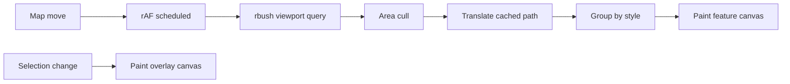
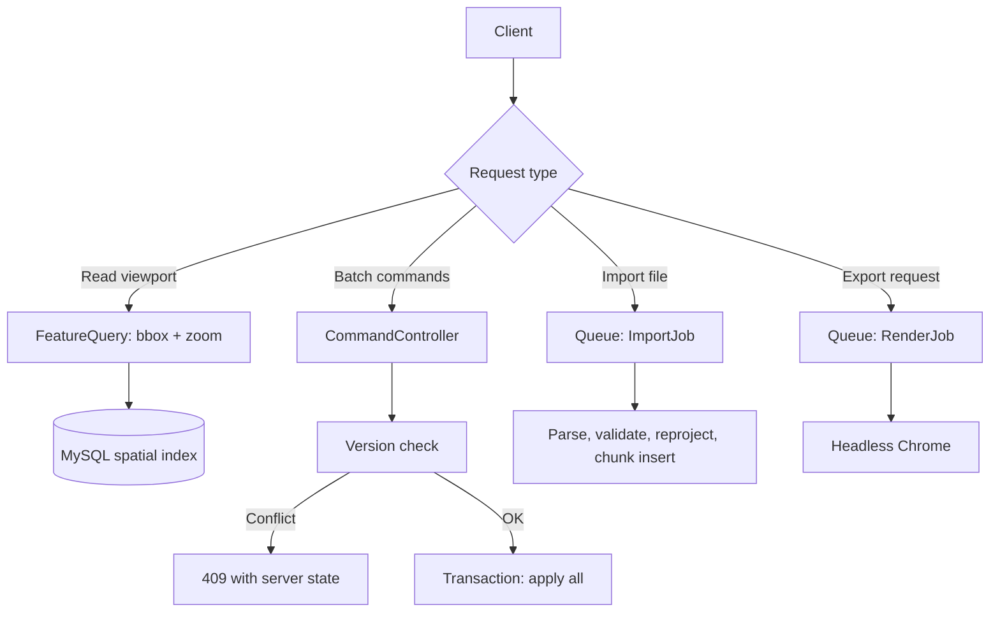
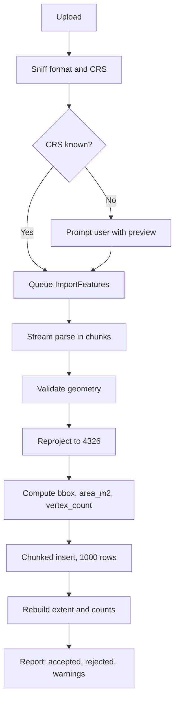
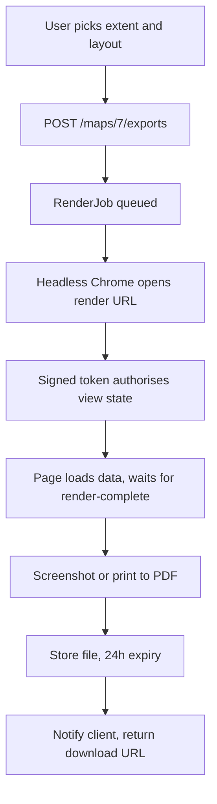
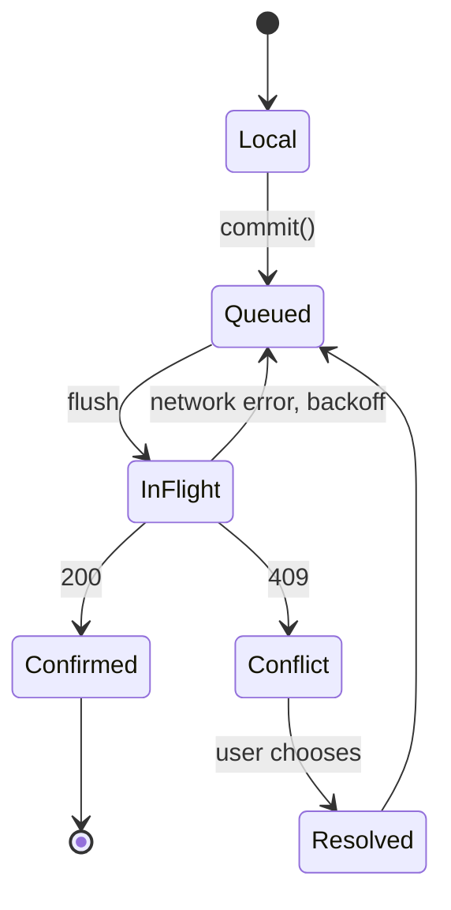

# GIS Web Interface — Technical Specification

2026-09-18 · @Someone

## 1. Scope

A browser-based GIS editing and publishing interface: Leaflet, ES modules built by the application's existing Vite pipeline, backed by a Laravel + MySQL 8 API. It renders a 1.4-million-feature cadastral dataset at 60fps on a mid-tier device, drawing roughly 13,000 features per view after the area cull in section 4.

**In scope for v1**

- Layer CRUD, grouping, ordering, visibility and opacity through a drag-and-drop tree
- Drawing and editing of points, lines, polygons, rectangles and circles
- Raster image overlays: upload a PNG or JPEG and georeference it by dragging its four corners
- 4.3 million cadastral, land-use and administrative features imported from public ArcGIS services, rendered by area cull
- Geodesic measurement (distance, area, radius, diameter, bearing) with SI / imperial toggle
- Data-driven styling, labels and legend
- Attribute table with filtering, sorting and map-linked selection
- Spatial and attribute query, server-backed, with a map control panel for basemaps, search and coordinates
- Undo / redo across all editing operations
- Responsive layout down to phone width

**Deferred to v2**

These are specified in full below, because the v1 architecture must not foreclose them, but no endpoint or UI for them ships in v1.

- Import of vector data from a *file*, in any format (section 12). v1 features come from an existing database by a one-off import command (section 12) or from drawing. Image overlays also upload in v1 — see section 13, and the note below.
- Export of map images and print layouts, client-side or server-side (section 15)
- Share links and embed mode (section 15)
- The job protocol, which exists only to serve the above (section 7)

The image-overlay exception is deliberate and worth stating plainly, because it is the one place v1 crosses a line the scope cut drew. An overlay carries no features, no attribute schema, no geometry and no CRS negotiation: it is a file, a name and four corner coordinates. It needs none of the import pipeline in section 12 — no streaming parser, no validation report, no reprojection, no job protocol — so it costs one upload endpoint rather than a milestone. What it does introduce is v1's first multipart write path, which is why its upload rules are specified in section 20 rather than inherited from the v2 import limits.

**Out of scope entirely**

- Real-time multi-user co-editing. v1 ships optimistic locking, but co-editing is expected within a year, so section 16 builds the groundwork for it
- Raster analysis, terrain, or network routing
- Offline field use and tile caching
- Server-side vector tiling
- 3D / terrain rendering

**Support matrix**

| Target | Requirement |
| --- | --- |
| Browsers | Last 2 versions of Chrome, Edge, Firefox, Safari |
| Required APIs | ES modules, ResizeObserver, Pointer Events, Web Workers, OffscreenCanvas (optional) |
| Reference device | 4-core mobile-class CPU, 4 GB RAM, tested at 4x CPU throttle |
| Minimum viewport | 360 x 640 |
| Server | PHP 8.4, Laravel 13, MySQL 8.0.23+ |

No Internet Explorer, no legacy Edge.

Redis is not a v1 requirement. The deployment runs `QUEUE_CONNECTION=sync` and no v1 endpoint is asynchronous; Redis arrives with the job protocol in v2.

## 2. Principles

Five rules settle most design arguments later. They are listed in priority order.

1. **Debuggability over convenience.** A stack trace points at a line you wrote, in a file you wrote. Vite serves this package's own source unbundled and untransformed in development, so what the browser runs is what the file says. No proxy-based reactivity, no dependency graph you cannot read. This is the rule that ruled Alpine out.
2. **One choke point for state.** Every mutation is a command object passed to `commit()`. That single function is where you log, undo, sync and replay.
3. **The map is not a DOM component.** UI state and geometry rendering are separate subsystems with separate update cycles. A UI re-render must never touch Leaflet.
4. **MySQL stores, PHP and the client compute.** MySQL 8 holds geometry, indexes it and answers spatial predicates. Buffer, union, simplify and validity repair live in `GeometryService`.
5. **Budgets are acceptance criteria.** The numbers in section 19 are test cases, not aspirations. A feature that breaks a budget is not done.

The cost of these rules is more hand-written code: a canvas renderer, a spatial index, a virtual list. The benefit is that when something is wrong at 160,000 candidate features, the problem is in code you can read.

## 3. Client architecture

ES modules built by the application's existing Vite pipeline, UI chrome rendered with jQuery against a hand-written row recycler, and one command-based store. No second frontend framework.

### Module loading

The package's client source lives at `packages/gis/resources/js/**` and is registered as an additional input on the root `vite.config.js`, alongside the stylesheets already built there. The Blade view loads it with `@vite`, so Vite's manifest handles content hashing and cache busting — the same mechanism the rest of the application already uses. In development `npm run dev` serves modules unbundled over the Vite dev server; in production `npm run build` emits hashed chunks.

Leaflet is **not** imported. It is already vendored in this repository at `public/packages/leaflet/dist/leaflet.js` (1.9.4, UMD) and is loaded as a plain `<script>` before the bundle, exposing the global `L`, which the bundle treats as external. This is the convention `vite.config.js` already documents for jQuery, Bootstrap, CoreUI and DataTables: legacy UMD globals are copied through untouched rather than bundled.

Two consequences are worth stating, because both are the point:

- There is exactly one Leaflet in the application. The `latlng_picker` CRUD field and the GIS editor can appear in the same session without loading the library twice or fighting over `L`.
- The GIS bundle contains no Leaflet bytes, so the initial-transfer budget in section 19 measures only code this package owns.

The remaining third-party dependencies come from npm through the root `package.json` and are bundled normally:

| Package | Loading |
| --- | --- |
| `rbush` | Bundled, initial chunk |
| `@turf/*` | Bundled per function (`@turf/area`, `@turf/boolean-intersects`), so unused modules never enter the graph |
| `proj4` | Bundled, initial chunk (v2: import reprojection) |
| `shpjs`, `supercluster`, `georaster` | `await import()` at point of use, so Vite emits them as separate chunks that load on demand |

Nothing is vendored into `public/vendor/`, and there is no hand-written import map, no module manifest command and no modulepreload list. Those existed in an earlier draft to work around native ESM's discovery waterfall and its lack of cache busting; bundling removes both problems, and the application already owns a build step it must run regardless.

One constraint from that draft survives, because it was never about bundling: **optional dependencies stay lazy**. Shapefile parsing, clustering and raster support load at point of use, not at startup. The initial-transfer budget in section 19 is the thing that enforces it.

### UI layer

Every piece of UI chrome — layer tree, attribute table, style panel, toolbar, legend, popups, conflict panel — is plain DOM built by a small module under `resources/js/ui/`, using jQuery for event binding and DOM manipulation. This matches how the application's existing CRUD fields are written (see `resources/views/crud/fields/latlng_picker.blade.php` and its `data-init-function` hook), and it adds no dependency.

Every component follows the same shape:

```js
import { store } from '../store/store.js';

export function mountLayerTree($root) {
  const render = () => { /* patch $root from store.state.tree */ };
  const unsub = store.subscribe('layers', render);
  render();
  return () => unsub();          // teardown
}
```

Subscribe on mount, unsubscribe on teardown, render from store state. No component holds authoritative state; local state is limited to transient UI concerns such as which node is mid-drag.

**Lists are recycled, not re-rendered.** The layer tree (2,000 nodes) and the attribute table (10,000 rows) both render through the shared `ui/virtual-list.js`, which keeps only visible rows plus a small overscan in the DOM and patches recycled row elements in place. That recycler is hand-written and owns its own diffing, which is why a templating library with virtual-DOM diffing was considered and rejected: the two views where diffing would pay are precisely the two that bypass it.

The trade is known and accepted. Panels with many small inputs — the style panel, inline attribute editors — are more verbose imperatively than they would be declaratively. In exchange the package introduces no third templating idiom into a codebase that already has Blade and jQuery, and the project's standing "no other frontend frameworks" rule holds without an exception.

Two rules are enforced in review, both from section 20:

- Attribute values reach the DOM through `textContent` or `.text()`. `innerHTML` and jQuery's `.html()` are forbidden in any code path touching feature data.
- CSS is plain and class-scoped, one stylesheet per component directory, compiled through the existing SCSS pipeline. No Shadow DOM: it fights global CSS and Leaflet's own stylesheet for no benefit here.

### State

One store module. State is a plain object, mutated only through commands.

```js
const state = {
  layers: {},        // id -> layer metadata + style
  tree: [],          // ordered node list, each { id, parentId, expanded }
  selection: new Set(),
  measurements: [],
  ui: { activeTool: null, docks: {}, units: 'si' }
};

export function commit(command) {
  const inverse = command.apply(state);   // returns its own undo
  undo.push({ command, inverse });
  sync.enqueue(command);                  // section 16
  emit(command.topics);                   // ['layers', 'layers:42']
}
```

Subscription is by topic string, not by dependency tracking. Topics are coarse and explicit (`layers`, `layers:42`, `selection`, `ui.units`). A component that subscribes too broadly re-renders more often; for the static panels that cost is negligible, the virtualized views recycle rows rather than rebuild them, and predictability is worth more than minimal renders.

No proxies, no getters, no dirty-checking. If state changed and the UI did not update, the cause is a missing topic in `command.topics` — one place to look.

### Boundaries

| Subsystem | Owns | Updates on |
| --- | --- | --- |
| Store | Layer metadata, style, tree, selection, UI state | `commit()` |
| Renderer | Geometry typed arrays, spatial index, canvases | `requestAnimationFrame` |
| Leaflet | Basemap tiles, panes, editing handles, map viewport | Map events |
| Sync | Outbound command queue, server versions | Network |

The renderer subscribes to the store for style and visibility changes, but geometry never enters the store. This keeps the store small enough to serialise for a bug report.

### File layout

```
packages/gis/resources/js/
  main.js
  store/
    store.js  commands/  undo.js  sync.js
  map/
    renderer.js  geometry.js  spatial-index.js  panes.js
    draw/  edit/  measure/  snap.js
  data/
    io/{geojson,kml,gpx,shapefile,csv,wkt}.js
    crs.js  schema.js
    worker/parse.worker.js
  ui/
    layer-tree.js  attribute-table.js  style-panel.js
    toolbar.js  legend.js  virtual-list.js  bottom-sheet.js
  lib/
    emitter.js  dom.js  format.js  units.js  http.js
```

Stylesheets sit beside the components they belong to under `packages/gis/resources/scss/`, imported by the package's own entry stylesheet.

### Dependencies

| Package | Purpose | Source | Approx. size |
| --- | --- | --- | --- |
| leaflet | Map, tiles, panes, interaction | Already vendored, global `L` | 0 kB added |
| jquery | Event binding, DOM for UI chrome | Already loaded by the shared `inc.scripts` partial | 0 kB added |
| rbush | Spatial index | npm, bundled | 3 kB gz |
| @turf/\* | Geodesic measurement, geometry ops | npm, bundled per function | 5-40 kB depending on imports |
| proj4 | CRS reprojection on import (v2) | npm, bundled | 14 kB gz |
| shpjs | Shapefile parsing (v2) | npm, lazy chunk | 60 kB gz |
| supercluster | Point clustering | npm, lazy chunk | 6 kB gz |

Anything else needs a written justification. No templating library is used: see the UI layer above. Shapefile and cluster support load on demand, not at startup.

## 4. Map rendering engine

A custom `L.Layer` subclass draws all features onto canvases it owns. Leaflet's own path layers are used only for the few dozen interactive objects on screen at once: vertex handles, in-progress geometry, measurement labels.

The reason is structural. Leaflet creates one DOM node or one `L.Path` object per feature, and its canvas renderer hit-tests by scanning every layer on every mouse move. Both are linear in feature count. Against 159,654 candidates in a zoom-12 viewport neither is survivable.

### Geometry storage

Parsed GeoJSON is discarded after import. Geometry lives in flat typed arrays, one set per layer:

```js
{
  coords:     Float64Array,   // interleaved lng, lat
  ringStarts: Uint32Array,    // index into coords, per ring
  featStarts: Uint32Array,    // index into ringStarts, per feature
  types:      Uint8Array,     // point | line | polygon | circle
  bbox:       Float64Array,   // 4 per feature, for the index
  ids:        Uint32Array
}
```

The imported `Lot` layer — 672,132 features averaging 6.5 vertices — holds roughly 70 MB of coordinates; the 12,929 drawn in a zoom-12 viewport are about 1.4 MB of it. The equivalent as GeoJSON objects is 60-100x that, and the allocation churn alone causes visible GC pauses.

Circles store centre and a radius in metres, not a densified ring. They are densified only at draw time and at export.

### Spatial index

One `rbush` per layer, built from `bbox` at import, in the worker. It answers two questions:

- **Viewport culling.** `search(viewportBounds)` returns candidate features to draw.
- **Hit-testing.** `search(cursorBounds)` returns a handful of candidates; exact point-in-polygon or distance-to-segment runs only on those.

Target hit-test time is under 5 ms including the exact test. The index is rebuilt on bulk edit, and patched incrementally on single-feature edits.

### Draw cycle



Redraws are coalesced onto `requestAnimationFrame`; multiple invalidations in one frame produce one paint. During an active pan the cached path is translated with `ctx.setTransform` rather than rebuilt, and labels are skipped; on `moveend` it repaints at full fidelity. Geometry is never coarsened — see *Level of detail* below.

Features are batched by resolved style so canvas state changes (`fillStyle`, `strokeStyle`, `lineWidth`) are minimised. Within a batch, paths are accumulated into one `Path2D` and filled once.

### Canvas separation

| Canvas | Contents | Repaints on |
| --- | --- | --- |
| Feature | All visible features, by layer order | Viewport, style, visibility, data change |
| Overlay | Selection highlight, hover, measurement graphics | Selection or pointer change |
| Edit | Vertex handles, midpoints, snap indicators | Vertex drag |

Dragging a vertex repaints only the edit canvas. Without this split, every pointer move during editing costs a full repaint of every drawn feature.

### Level of detail

**Area culling is the primary mechanism, not simplification.** This is the opposite of what a vector-rendering design usually assumes, and it follows from what the data is.

The workload is cadastral parcels: 672,000 lots averaging 6.5 vertices and 3.6 million land-use polygons averaging around 11 to 17. A parcel is a quadrilateral. Simplifying it does not remove a few vertices from a long boundary — it turns a rectangle into a triangle and then into a line. There is nothing to simplify, and the cost was never vertex count in the first place: it is the number of polygons.

**The administrative boundary layers invert every term of that argument, and the design absorbs them anyway.** They are few and enormous rather than many and tiny: 14 states averaging 25,982 vertices each, 93 districts averaging 5,257, 1,730 mukims averaging 466. Three features exceed 50,000 vertices; Sarawak's outline is 99,253. The area cull never drops one, because a state is never smaller than a pixel, so a visible boundary layer contributes its whole vertex count to the built path at every zoom — 364,000 vertices for all 14 states, which is a single path build of a few tens of milliseconds and then nothing, since paths are built per zoom and translated per frame (section 4, *Rendering*).

That is acceptable precisely because these layers are placed as a thin reference outline over the cadastre rather than as the working data, and because there are only 2,549 of them in total. It is not a licence to reintroduce simplification: a state boundary that has been simplified no longer coincides with the district boundaries inside it, and the gap is visible at exactly the zoom where someone is checking whether a parcel falls inside a mukim.

What makes that tractable is that **most parcels are smaller than a pixel at overview zooms.** 41% of lots are under 500 m², roughly a 22 m square, which at zoom 12 is 0.35 px². Dropping every polygon below a few square pixels at the current zoom flattens the draw count to a near-constant. Measured at a 4 px² threshold:

| Zoom | m/px at 3.8°N | Drop below | Features in view | Actually drawn |
| --- | --- | --- | --- | --- |
| 12 | 38.1 | 5,806 m² | 159,654 | 12,929 |
| 14 | 9.53 | 363 m² | 55,729 | 11,819 |
| 16 | 2.38 | 23 m² | 5,025 | 4,990 |

Zooming out shrinks parcels below the threshold faster than it admits new ones, so the drawn set stays near 13,000 at every zoom. That is the 10,000-feature design target, reached without vector tiling and without a degradation banner.

**A square-pixel threshold bounds nothing on its own, and S3 replaced it as the bound.** The table above was calibrated at one window size; a larger window simply admits more features, and at 1456 x 840 the same 4 px² took 3.6x the intended count. The read therefore **orders by `area_m2` descending and caps the row count** (section 7). The count is then bounded whatever the threshold is, and what falls off the end is always the least visible thing on the screen. The threshold survives as a cheap pre-filter that makes the cap cheap to serve, not as the thing that makes it correct.

**The cost moves from painting to culling.** At zoom 12 the spatial index returns 159,654 candidates to produce 12,929 drawn features, so the index query and the cull loop are the hot path, not the paint. Both are tight loops over typed arrays, which is what the storage design in this section exists to make possible.

Two consequences the rest of the specification depends on:

- **The cull runs server-side first.** Shipping 160,000 features so the client can discard 92% of them would blow the transfer and first-render budgets. The feature read (section 7) applies the area threshold for the requested zoom, and the client re-culls for exactness against its actual viewport.
- `gis_features` carries an indexed area column for that filter (section 6). Computing area per row per request is not an option at this row count.

**There is no simplification anywhere in this package, and it must not come back without new measurements.** An earlier draft of this section kept it for the minority case — the few large polygons that stay on screen at every zoom — with a per-band Visvalingam-Whyatt tolerance and a `geom_simple` column. S2 removed all of it, and the numbers are why: the vertex mask saved 0.03% to 1.3% of vertices across zooms 11 to 15, and a full path rebuild measured 24.6 ms with it against 24.8 ms without. It had also been silently destroying large features, because its threshold was a constant left behind when client coordinates moved from degrees to normalised Web Mercator.

The distinction that replaced it is worth stating plainly: **the area cull varies which features are drawn, never what shape they are.** A feature arrives with the vertices it was imported with, or it does not arrive. Dropping a feature is honest; reshaping one is not. Coordinate quantisation below the editing zoom varies precision, not vertices, and is not level of detail in this sense.

Points denser than one per 8 px are still clustered via supercluster; clustering replaces a group of features with a marker rather than reshaping a geometry, so it is not level of detail either.

If the long tail ever does justify simplification, it belongs at import — one pass over the data, stored — and not in a worker recomputing it per response.

### Workers

Import parsing, reprojection and index construction run in `parse.worker.js`. Results return as transferable `ArrayBuffer`s, so there is no structured-clone cost on handoff.

The worker stays dependency-free — no Turf, no Leaflet — so its only job is arithmetic over typed arrays. Vite builds it from `new Worker(new URL('./worker/parse.worker.js', import.meta.url), { type: 'module' })`, which emits it as its own chunk with a hashed filename and no manual registration. Reprojection uses a small inlined proj4 subset.

### Leaflet integration

Leaflet is the vendored UMD build loaded as the global `L` (section 3), so the renderer subclasses `L.Layer` directly with no import.

One Leaflet pane per top-level tree group, with `zIndex` assigned from tree order. This is the only mechanism that gives real z-ordering between the custom canvas layer, tile layers and editing handles.

The custom layer implements `onAdd`, `onRemove`, `getEvents` (returning `{ viewreset, zoom, moveend, move }`) and positions its canvases with `L.DomUtil.setTransform` during zoom animation so the rendering follows Leaflet's animated transform rather than repainting mid-animation.

## 5. Backend architecture

Laravel 13 over MySQL 8. MySQL is treated as indexed geometry storage and a predicate engine; all constructive geometry work happens in PHP or on the client.

### What MySQL 8 provides

| Capability | Notes |
| --- | --- |
| SRID-aware `GEOMETRY` columns | Geographic semantics on SRID 4326 |
| R-tree `SPATIAL INDEX` on InnoDB | Requires `NOT NULL` and an SRID restriction |
| `ST_Distance`, `ST_Length`, `ST_Area` | Return metres / m² on 4326 |
| `ST_Intersects`, `ST_Within`, `ST_Contains` | Index-usable predicates |
| `ST_IsValid`, `ST_IsSimple` | Validation at ingest |
| `ST_Transform` | Reprojects between SRIDs, including geographic to projected. All ten EPSG codes in the section 12 registry are present in `INFORMATION_SCHEMA.ST_SPATIAL_REFERENCE_SYSTEMS` |

That covers every per-request path: viewport queries, select-by-region, server-side measurement verification.

### What it does not provide, and where the work moves

| Need | MySQL 8 status | Implementation |
| --- | --- | --- |
| `ST_Buffer` | Cartesian only, errors on 4326 | Project, compute in GEOS, project back — see below |
| `ST_Union`, `ST_Difference`, `ST_Intersection` | Cartesian only | Same |
| `ST_Simplify` | Cartesian only, can emit invalid output | Not used. Simplification was removed outright in S2 — see *Level of detail* |
| `ST_MakeValid` | Not available | Validate at ingest; repair or reject in PHP |
| `ST_AsMVT` | Not available | Not needed: the area cull (section 4) holds the drawn set near 13,000 without tiling |
| Clustering | No `ST_ClusterDBSCAN` | supercluster, client-side |

None of these sits on a hot path. Buffer and union run when a user clicks a button, not on every pan, which is what makes this division workable.

#### GEOS is planar too, and that changes the recipe

It is tempting to read the table above as "MySQL is Cartesian, GEOS is geodesic". **It is not.** GEOS treats coordinates as abstract Cartesian numbers with no units at all. Asked to buffer `POINT(103.326 3.8077)` by 250, `geosop` returns a polygon spanning longitude 353 and latitude −241: it read 250 as *degrees*. Its `area` of a parcel-sized ring returns square degrees.

The difference between the two is not planar versus geodesic. It is that MySQL refuses geographic input and GEOS computes on whatever it is given. Handing GEOS lon/lat and a distance in metres produces a confidently wrong answer, which is worse than the refusal.

The working recipe, verified on this deployment:

```
ST_Transform(geom, <metric SRID>)   -- MySQL, 4326 -> metres
  → geosop bufferQuadSegs 250 32    -- GEOS, metres in and out
  → ST_Transform(result, 4326)      -- MySQL, back to storage CRS
```

Measured at Kuantan against a 250 m buffer:

| Quadrant segments | Resulting radius | Area error |
| --- | --- | --- |
| 8 (the `geosop` default) | 248.79 m | −0.647% |
| 32 | 249.91 m | −0.046% |

**Use 32.** The default's 0.65% is the polygonal approximation of a circle, not a projection error, and it breaches the 0.1% client/server agreement that section 11 makes a test case. At 32 the error is 0.046% and the round trip through `ST_Transform` is exact.

The metric SRID is chosen per geometry from its centroid longitude: UTM 47N (32647) west of 102°E, UTM 48N (32648) east of it. The data extent, 101.33°E to 104.21°E, straddles that meridian, so both are in use and neither can be hardcoded.

Two consequences worth noting:

- **No PHP reprojection library is needed.** MySQL does both transforms, so `proj4php` never enters the dependency list. The client-side `proj4` in section 3 is only for v2 import preview, and may prove unnecessary there too.
- Topological operations — union, difference, intersection — are projection-invariant in the shapes they produce, but their vertices are not. They go through the same transform pipeline so that output coordinates are exact rather than approximately right.

### Two footguns

**Axis order.** MySQL follows the EPSG definition of 4326, which is latitude-longitude. Every GIS tool and every GeoJSON file is longitude-latitude. Mixing them produces geometry in the wrong hemisphere with no error raised.

```sql
-- wrong result, silently
ST_GeomFromText('POINT(101.6 3.1)', 4326)

-- correct
ST_GeomFromText('POINT(101.6 3.1)', 4326, 'axis-order=long-lat')
ST_AsText(geom, 'axis-order=long-lat')
```

This must be wrapped in one cast class on day one. `ST_GeomFromText` and `ST_AsBinary` must not appear anywhere else in the codebase, enforced by a `grep` assertion in the test suite.

**Spatial index preconditions.** The column must be `NOT NULL` and SRID-restricted or no index is created, and MySQL will not warn. Every viewport query must be checked with `EXPLAIN` to confirm it selects the spatial index rather than a full scan.

### GeometryService

All constructive geometry goes behind one interface:

```php
interface GeometryService {
    public function buffer(Geometry $g, float $metres): Geometry;
    public function union(array $geoms): Geometry;
    public function difference(Geometry $a, Geometry $b): Geometry;
    public function simplify(Geometry $g, float $tolerance): Geometry;
    public function makeValid(Geometry $g): Geometry;
    public function isValid(Geometry $g): ValidationResult;
}
```

The v1 implementation is `GeosGeometryService`, using `brick/geo`, an approved dependency added in session S0, driving GEOS through the transform recipe above.

**`brick/geo` has no pure-PHP engine, and an earlier draft of this section was wrong to promise one.** It delegates every constructive operation to one of four backends, all external:

| Engine | Needs | Viable here |
| --- | --- | --- |
| `GeosOpEngine` | the `geosop` CLI binary, shipped with libgeos 3.11+ | **Yes, and installed** — GEOS 3.15.0 at `/opt/homebrew/bin/geosop`. No PHP extension to compile |
| `GeosEngine` | the `geos` PHP extension | Yes, but the extension must be built against libgeos and is awkward to keep current |
| `PdoEngine` | MySQL, MariaDB or PostGIS over PDO | **No.** Against MySQL it is Cartesian-only and 2D-only, which is exactly the limitation this service exists to route around |
| `Sqlite3Engine` | SpatiaLite (`mod_spatialite`) | Possible, but adds a second spatial stack for no gain over geosop |

`GeosOpEngine` is the choice: it needs a binary on `PATH`, not a PHP build. It is installed on the development machine; the server needs the same package.

Because the engine is a subprocess, `GeometryService` must treat it as one: a timeout, a bounded input size, and no unsanitised interpolation into the command line. Geometry reaches it as WKT on stdin, never as a shell argument.

Where no engine is available, `GeometryService` reports `capabilities.geos: false` and every server-side operation is refused with a clear message. It does not silently degrade to a wrong answer, because a buffer computed in the wrong coordinate system looks plausible and is not.

Because the application runs on Octane, the binding matters: `GeometryService` is registered with a resolver closure, never constructed with the container, request or config repository injected into it, and it accumulates no static state across requests.

This interface is the migration path. Geometry is stored as standard WKB with identical SRID semantics, so moving to PostGIS later means swapping one implementation, not rewriting the application.

### Request flow



### Jobs, queues and the scheduler

**No queued jobs ship in v1.** Every v1 endpoint is synchronous, so Redis queues are not on the critical path and the deployment's `QUEUE_CONNECTION=sync` is sufficient.

**Reverb does ship in v1**, because real-time multi-user editing is expected within a year (section 23). That changes the calculus: a websocket server stood up only for conflict notices would not be worth the operational surface, but one that presence and live cursors will need anyway is cheaper to introduce now than to retrofit alongside a co-editing feature. In v1 it carries conflict notices and nothing else, on the `private-map.{id}` channel.

#### The scheduler

Three things in this specification expire: soft-deleted maps and layers after 30 days, rendered exports after 24 hours (v2), and overlay images orphaned when their layer's restore window lapses (section 13).

**The application currently has no scheduler.** `Kernel::schedule()` is empty, and there is no cron, Procfile or supervisor configuration in the repository. Nothing would run these sweeps, and the files would accumulate indefinitely while the specification claimed otherwise.

S0 therefore registers `gis:sweep` and documents the single cron entry a deployment needs:

```
* * * * * cd /path/to/app && php artisan schedule:run >> /dev/null 2>&1
```

The sweep is idempotent and safe to run repeatedly. If a deployment declines to add the cron entry, the consequence is precise and should be stated rather than discovered: soft-deleted rows are never purged, so the 30-day restore window becomes indefinite, and orphaned overlay images are never reclaimed. Nothing breaks; storage grows.

#### The v2 job inventory

For planning:

| Job | Queue | Timeout | Ships |
| --- | --- | --- | --- |
| `ImportFeatures` | `import` | 600 s | v2 |
| `RenderExport` | `render` | 300 s | v2 |
| `BulkSetProperties` | `default` | 120 s | v2 |
| `RebuildLayerExtent` | `default` | 60 s | v1, synchronous; becomes a job in v2 |
| `PruneExports` | `default` | — | v2 |

## 6. Data model

Six core tables. Geometry is stored once, in SRID 4326. There is no second pre-simplified column: `geom_simple` existed briefly and was dropped in S2 along with every other form of level of detail.

### Tables

```sql
CREATE TABLE gis_maps (
  id            BIGINT UNSIGNED PRIMARY KEY AUTO_INCREMENT,
  owner_id      BIGINT UNSIGNED NOT NULL,
  name          VARCHAR(255) NOT NULL,
  view_state    JSON NOT NULL,          -- centre, zoom, basemap
  version       INT UNSIGNED NOT NULL DEFAULT 1,
  created_at    TIMESTAMP, updated_at TIMESTAMP,
  INDEX ix_owner (owner_id)
);

CREATE TABLE gis_layers (                -- identity: what the layer IS
  id            BIGINT UNSIGNED PRIMARY KEY AUTO_INCREMENT,
  owner_map_id  BIGINT UNSIGNED NULL,   -- NULL = global layer, owned by no map
  name          VARCHAR(255) NOT NULL,
  kind          ENUM('vector','group','tile','wms','image') NOT NULL,
  locked        TINYINT(1) NOT NULL DEFAULT 0,
  style         JSON NOT NULL,
  attr_schema   JSON NULL,
  source_config JSON NULL,              -- tile/WMS URL and API key ref, or image path + corners (section 13)
  extent        GEOMETRY NULL SRID 4326,
  feature_count INT UNSIGNED NOT NULL DEFAULT 0,
  version       INT UNSIGNED NOT NULL DEFAULT 1,
  created_at    TIMESTAMP, updated_at TIMESTAMP,
  INDEX ix_owner (owner_map_id)
);

CREATE TABLE gis_map_layer (             -- placement: where the layer SITS, per map
  id            BIGINT UNSIGNED PRIMARY KEY AUTO_INCREMENT,
  map_id        BIGINT UNSIGNED NOT NULL,
  layer_id      BIGINT UNSIGNED NOT NULL,
  parent_id     BIGINT UNSIGNED NULL,   -- references gis_map_layer.id, tree within this map
  sort_key      VARCHAR(64) NOT NULL,   -- fractional index
  visible       TINYINT(1) NOT NULL DEFAULT 1,
  opacity       FLOAT NOT NULL DEFAULT 1,
  min_zoom      TINYINT NULL,
  max_zoom      TINYINT NULL,
  access        ENUM('owner','edit','read') NOT NULL DEFAULT 'owner',
  version       INT UNSIGNED NOT NULL DEFAULT 1,
  created_at    TIMESTAMP, updated_at TIMESTAMP,
  UNIQUE KEY ux_map_layer (map_id, layer_id),
  INDEX ix_map_parent (map_id, parent_id, sort_key)
);

CREATE TABLE gis_features (
  id            BIGINT UNSIGNED PRIMARY KEY AUTO_INCREMENT,
  layer_id      BIGINT UNSIGNED NOT NULL,
  geom          GEOMETRY NOT NULL SRID 4326,
  minx          DOUBLE NOT NULL, miny DOUBLE NOT NULL,
  maxx          DOUBLE NOT NULL, maxy DOUBLE NOT NULL,
  area_m2       DOUBLE NOT NULL DEFAULT 0,   -- 0 for points and lines
  vertex_count  INT UNSIGNED NOT NULL,
  properties    JSON NOT NULL,
  version       INT UNSIGNED NOT NULL DEFAULT 1,
  created_at    TIMESTAMP, updated_at TIMESTAMP,
  SPATIAL INDEX sx_geom (geom),
  INDEX ix_layer (layer_id),
  INDEX ix_layer_bbox (layer_id, minx, maxx),
  INDEX ix_layer_read (layer_id, area_m2, minx, maxx, miny, maxy)
);
```

Plus `gis_measurements` (saved annotations, same shape as features), `gis_map_user` (per-map access, section 20) and — in v2 — `gis_share_links` and `gis_import_jobs`.

```sql
CREATE TABLE gis_map_user (
  map_id        BIGINT UNSIGNED NOT NULL,
  user_id       BIGINT UNSIGNED NOT NULL,
  role          ENUM('owner','editor','contributor','viewer') NOT NULL,
  created_at    TIMESTAMP, updated_at TIMESTAMP,
  PRIMARY KEY (map_id, user_id),
  INDEX ix_user (user_id)
);
```

**Every table in this package carries the `gis_` prefix.** `maps`, `layers` and `features` are names a shared base backend will want for something else sooner or later, and the prefix costs nothing now. It also settles the reuse question in section 23 — the package is namespaced for reuse across projects from the first migration rather than through a rename later.

### Why layers are split in two

A layer can appear in more than one map. That is the mechanism behind shared layers (section 8), and it is why identity and placement are separate tables rather than one.

The split falls out of asking which columns would have to differ between two maps showing the same layer. Position in the tree, visibility, opacity and zoom range all would — they describe where a layer sits in *this* map. Name, kind, style, schema, extent and feature count would not — they describe the layer itself, wherever it appears.

This matters most for the data that motivated it. The import brings 3.6 million cadastral and land-use features into three layers, "Lot", "Gunatanah Semasa" and "Gunatanah Zoning" (section 12). Those exist **once**, with `owner_map_id` NULL, and every map places them read-only. Without the split, a second map over the same cadastre would mean a second copy of 4.3 million rows.

`owner_map_id` NULL means a global layer, owned by no map: the imported base data. A layer created by drawing is owned by the map it was created in, which is where authority to delete it lives.

The cost is that the layer tree is now a join rather than a single-table read, and that `gis_map_layer.parent_id` references a placement rather than a layer — the tree is per-map structure, so a layer shared into two maps can sit under different groups in each.

**Do this in S1.** Retrofitting it means migrating live rows and rewriting every tree query.

### Why `area_m2` is stored

Area culling by zoom (section 4) is the mechanism that keeps the drawn set near 13,000 features regardless of how far out the user zooms, and it runs server-side so that 160,000 features never cross the wire. That filter needs an indexed scalar. Computing area per row per request is not an option at this row count, and `ST_Area` on SRID 4326 is a geodesic computation, not a cheap one.

It is written once at ingest, geodesically, and is zero for points and lines — which are culled by length or not at all, never by area.

### Why the redundant bbox columns

`minx`/`miny`/`maxx`/`maxy` duplicate what the spatial index knows, but they allow ordinary B-tree filtering combined with non-spatial predicates, cheap extent aggregation (`SELECT MIN(minx), MAX(maxx) ...`) without touching geometry, and sorting by size. The spatial index cannot be combined with other index conditions in MySQL, so these earn their storage.

### Generated columns for attribute filters

MySQL cannot index inside a JSON document. Attributes that users filter on get promoted:

```sql
ALTER TABLE gis_features
  ADD COLUMN status VARCHAR(32)
    AS (properties->>'$.status') STORED,
  ADD INDEX ix_layer_status (layer_id, status);
```

These are created by a migration generated from the layer's `attr_schema` when a field is marked indexed. Limit to eight per layer; beyond that the write cost outweighs the read benefit.

### Geometry rules

| Rule | Value | Enforcement |
| --- | --- | --- |
| SRID | 4326, always | Column constraint |
| Axis order | long-lat on every read and write | `GeometryCast` only |
| Max vertices per feature | 50,000 | Ingest validation, split or reject |
| Max WKB per row | 4 MB | Below `max_allowed_packet` (set to 64 MB) |
| Multi-part handling | Split into rows where semantically separate | Import option |
| Validity | `ST_IsValid` at ingest | Repair via `GeometryService::makeValid`, or reject with a reason |

### Versioning

Every mutable row carries a `version` integer, incremented on write. Clients send the version they last read; a mismatch returns `409` with the current server state. There is no row-level locking and no long transactions.

`gis_map_layer.sort_key` uses a fractional index (base-62 strings, e.g. `a0`, `a0V`, `a1`) so reordering a node writes one row rather than renumbering siblings. This matters for drag-and-drop responsiveness in deep trees.

## 7. API contract

Six shapes, not one uniform REST surface: a bootstrap read, a binary feature read, a single command endpoint for all writes, an RPC endpoint for constructive geometry, a multipart upload for overlay images, and — in v2 — a job protocol for anything asynchronous.

The governing property: **the client's command vocabulary and the API's command vocabulary are the same vocabulary.** Undo, sync, conflict resolution and the audit log all speak it. A translation layer between store commands and API payloads would mean the design has gone wrong.

All routes are under `/api/geo`, registered by the package's service provider with controllers in the package's own namespace (`Gis\Http\Controllers\Api`), not in `App\Http\Controllers\Api`.

**Authentication is the admin guard, by session cookie and CSRF token, same origin.** This API exists to serve this application's own editor page, which is a server-rendered Blade view behind the admin middleware; there is no third-party consumer and no token-issuance UI. A bearer-token scheme would add an issuance flow and a second auth path for no gain. The consequence for the client is that requests carry the session cookie automatically and must send `X-CSRF-TOKEN`; there is no token to store, refresh or leak. The application's shared `inc.scripts` partial already calls `$.ajaxSetup` with that header, so jQuery-issued requests are covered with no extra work; `fetch` calls in this package set it explicitly.

### Endpoint summary

| Method | Path | Shape |
| --- | --- | --- |
| GET | `/maps` | List the maps this user may open, paged and searchable |
| POST | `/maps` | Create a map, optionally copied from an existing one |
| GET | `/maps/{map}` | Bootstrap: metadata, layer tree, styles, capabilities |
| PATCH | `/maps/{map}` | Rename and view state, versioned |
| DELETE | `/maps/{map}` | Soft delete, restorable for 30 days, owner only |
| GET | `/layers/{layer}/features` | Binary or GeoJSON feature read by bbox |
| POST | `/maps/{map}/commands` | All mutations, atomic and idempotent |
| GET | `/maps/{map}/commands` | Replay: the batches applied since a given map version |
| POST | `/geometry/ops` | Constructive geometry above the client vertex limit |
| GET | `/layers` | The layer library: layers this user may place, paged and searchable |
| POST | `/layers/{layer}/query` | Spatial and attribute query; returns ids, a count or features |
| POST | `/images` | Multipart upload of an overlay image; returns path and natural dimensions |
| GET | `/app/static-map` | Existing endpoint; see section 13. Tiles are not served by this API |

The v1 surface is twelve endpoints, the thirteenth row being an existing endpoint outside this API. `POST /geometry/ops` (section 9) ships in v1 because `brick/geo` with GEOS is an approved dependency, and `POST /images` is the one multipart write in v1, serving overlay images and marker SVGs (sections 10 and 13). Import, export, share and the job protocol are deferred to v2; their contracts are specified below, marked *(v2)*, so the v1 implementation can be built without foreclosing them.

The constraint that makes this safe is that **every v2 endpoint above either creates commands or reads features** — none introduces a new write path. Import ultimately produces `feature.create` commands; export reads features. Deferring them removes work without changing the shape of what ships.

### Map creation

```json
POST /api/geo/maps
{
  "name": "Site survey",
  "viewState": { "center": [101.6288, 3.1314], "zoom": 12, "basemap": "osm" },
  "from": { "kind": "copy", "mapId": 7 },
  "clientId": "a3f9c2",
  "seq": 1
}
```

Every field is optional except `name`. Response is `201` with the same body shape as the bootstrap read, so the client can hydrate its store from the creation response without a follow-up `GET`.

```json
{ "id": 12, "name": "Site survey", "version": 1,
  "viewState": { "...": "as sent, or the deployment default" },
  "layers": [ ],
  "capabilities": { "geos": true, "maxBatch": 500 } }
```

This is one of only two writes that sit outside the command envelope — the other being the image upload in section 13 — for the obvious reason that there is no map to address a command to yet. It still carries `(clientId, seq)` and is idempotent on that pair, so a retry after a timeout returns the original map rather than creating a second one — a duplicate map is a worse failure than a duplicate feature, because the user may not notice until both have diverged.

`from` seeds the new map:

| `kind` | Behaviour |
| --- | --- |
| omitted | Empty map: the default basemap and nothing else. No layers are placed automatically — the user adds what they need from the layer library (section 8), including the cadastral base |
| `copy` | Recreates the source map's tree by **sharing its layers**, not duplicating them. No features are copied at any size |
| `import` | v2, with import |

Copying a map creates placements, never features. The source map's layers are shared into the new map — `read` for layers the source does not own, `edit` for those it does — so copying a statewide map holding 4.3 million features writes a handful of rows and completes instantly.

This supersedes an earlier design in which copy duplicated features up to a 20,000-row cap. That cap was written when a map was assumed to hold a few thousand hand-drawn features; against real data it would reject every copy, and duplicating 4.3 million cadastral rows per copy was never the right behaviour anyway. Shared layers (section 8) make the question disappear rather than answer it.

A user who genuinely wants an independent copy of a layer's features uses **Duplicate** on that layer (section 8), which is explicit, scoped to one layer, and prompts above 5,000 features.

### Layer library listing

```
GET /api/geo/layers?q=lot&kind=vector&excludePlacedIn=7&page=1
```

```json
{ "data": [
    { "id": 12, "name": "Lot", "kind": "vector", "ownerMapId": null,
      "ownerMapName": null, "featureCount": 672112,
      "extent": [101.333, 2.495, 104.214, 4.743],
      "updatedAt": "2026-09-18T04:11:02Z",
      "availableAccess": ["read"], "placedInThisMap": false } ],
  "meta": { "page": 1, "perPage": 25, "total": 2 } }
```

Returns every global layer plus every layer owned by a map the user may open, and nothing else. `availableAccess` is computed per user per layer: `read` for anything listed, `edit` only where they already hold edit rights on that layer. The client renders exactly the levels offered, and `layer.share` re-checks them server-side — a modal cannot be an authorization boundary.

`excludePlacedIn` marks rather than hides layers already in the given map, so a user searching for something they already added sees why it is not selectable.

### Map listing and deletion

```
GET /api/geo/maps?q=survey&sort=-updated_at&page=2&deleted=0
```

```json
{ "data": [
    { "id": 7, "name": "Site survey", "layerCount": 4, "featureCount": 8421,
      "updatedAt": "2026-09-18T04:11:02Z", "owner": "aina", "role": "owner",
      "deletedAt": null } ],
  "meta": { "page": 2, "perPage": 25, "total": 31 } }
```

The listing returns only maps the user may open, resolved through the `gis_map_user` pivot (section 20), and carries that user's `role` on each row so the client can decide which actions to offer without a second request. `deleted=1` lists soft-deleted maps still inside their restore window, and is refused for anyone who is not their owner.

`DELETE /api/geo/maps/{map}` soft-deletes, restorable for 30 days, and requires the owner role. It is refused with `409` for a map the requesting client currently has open.

### Bootstrap

```
GET /api/geo/maps/7
```

```json
{
  "id": 7, "name": "Site survey", "version": 31,
  "viewState": { "center": [101.6288, 3.1314], "zoom": 12, "basemap": "osm" },
  "layers": [
    { "placementId": 88, "layerId": 40, "parentId": null, "sortKey": "a0",
      "kind": "group", "name": "Base data", "visible": true,
      "access": "owner", "shared": false,
      "placementVersion": 3, "layerVersion": 1 },
    { "placementId": 89, "layerId": 12, "parentId": 88, "sortKey": "a0",
      "kind": "vector", "name": "Lot",
      "visible": true, "locked": false, "opacity": 1,
      "minZoom": null, "maxZoom": null,
      "access": "read", "shared": true, "ownerMapId": null,
      "style": { "mode": "graduated", "field": "keluasan" },
      "attrSchema": [ { "name": "mukim", "type": "string", "indexed": true },
                      { "name": "keluasan", "type": "float" } ],
      "extent": [101.333, 2.495, 104.214, 4.743],
      "featureCount": 672112,
      "placementVersion": 1, "layerVersion": 4 }
  ],
  "capabilities": { "geos": true, "maxBatch": 500,
                    "binaryFeatures": true, "inlineOpVertexLimit": 20000 }
}
```

No geometry in this response.

Each entry flattens a layer and its placement in this map, because that is how the tree renders it, but the two carry **separate ids and separate versions**. `placementVersion` guards reorder and visibility; `layerVersion` guards name, style and schema. Sending one where the other is meant is a conflict, which is the intended way to find that mistake.

`shared` is true when the layer is placed in more than one map, `access` is this map's permission over it, and `ownerMapId` is null for a global layer such as the imported cadastral base (section 12). Together they tell the client which affordances to render without a second request.

The `capabilities` block lets the client decide at runtime whether to route a geometry operation to the server or run it in Turf, rather than depending on a client-side config that drifts from what the server actually supports.

### Feature reads

```
GET /api/geo/layers/42/features?bbox=101.5,3.0,101.7,3.2&zoom=11&fields=status,name
Accept: application/vnd.gis.features+gis1-stream
```

| Parameter | Meaning |
| --- | --- |
| `bbox` | `minx,miny,maxx,maxy` in WGS84 lon-lat. Required |
| `zoom` | Drives the server-side area cull threshold (section 4), and the coordinate quantisation in the binary encoding — below `edit_min_zoom` ordinates are sent as biased `uint32`, at or above it as `float64`, because a coordinate that can be dragged and sent back must not be rounded on the way out |
| `fields` | Properties to include. Omitted means geometry and id only |
| `ids` | Explicit id list, bypasses bbox |
| `cursor` | Continuation from a previous partial response |
| `minArea` | Overrides the zoom-derived cull threshold in m². `0` suppresses the cull entirely, for export and attribute queries. Not sent for a viewport read |

#### Binary encoding

The default above 2,000 features. A header plus buffers mapping directly onto the renderer's typed arrays:

```
 0  char[4]   magic 'GIS1'
 4  uint16    version
 6  uint16    flags   bit 0 = an attribute tail follows
                      bit 1 = coordinates are quantised
 8  uint32    featureCount
12  uint32    ringCount
16  uint32    vertexCount
20  uint32    propertiesLength
24  uint32[8] section offsets, in the order below
56  uint32    totalLength
60  uint32    coordExponent, 0 when coordinates are float64
64  float64   coords, interleaved longitude and latitude
              ...or uint32, when the quantisation flag is set
    float64   bbox, 4 per feature
    float64   ids
    float64   area in m²
    uint32    ringStarts, ringCount + 1 with a sentinel
    uint32    featStarts, featureCount + 1 with a sentinel
    uint8     types   1 point, 2 line, 3 polygon, 4 circle
    char[]    attribute tail, JSON, only when fields= was sent
```

All float sections are 8-byte aligned so `new Float64Array(buf, offset, len)` succeeds without copying. Circles carry their centre in `coords` and their radius in the attribute tail.

**No cull counts in the header.** `culled`, `returned`, `capped` and `smallestReturnedM2` are only known once the last row has been read, and a header is written before the first — so they travel in the trailer frame described under *Streaming*. Only `X-Gis-Area-Threshold` is a header, because the threshold is derived from the zoom and is known up front.

**Quantisation is what replaced the `lod` byte an earlier draft carried here.** With a non-zero `coordExponent` (`gis.read.coord_exponent`) each ordinate becomes a `uint32` holding `round((lng + 180) * 10^e)` — the bias is what keeps it unsigned, and unsigned is what keeps it portable, since PHP's `pack()` has no signed little-endian code. It halves the coordinate section, which is two thirds of the payload, and it is **not applied at or above `edit_min_zoom`**: there a vertex can be dragged and sent back, so a rounded read would write its own rounding into storage and move the vertex again on every edit. Quantisation shortens every ordinate and drops none; that is the whole difference between it and the simplification this format used to signal.

The client views the buffers and hands them to the renderer: no parse, no object allocation, no GC pressure. A 10,000-feature GeoJSON response is roughly 14 MB and costs about 400 ms to parse on the reference device; the same data in this format is roughly 4 MB and under 5 ms to view. This is what makes the import and first-render budgets in section 19 reachable.

#### Streaming

**Both encodings stream, 100 features at a time** (`gis.read.stream_chunk`). A zoom-12 read is 23,000 features and 9 MB; holding that in memory before sending it, or in the client before drawing it, wastes the time the user spends looking at an empty map. Because the rows are ordered by area descending, the chunks arrive most-visible-first, so the partial picture is the useful part of the picture.

A single `GIS1` document cannot stream: its header carries the offset of every section, and those are not known until the last feature is encoded. So the binary response is **a sequence of framed `GIS1` documents**, each complete and self-describing:

```
uint8   kind: 1 features, 2 trailer
uint32  payload length, little-endian
bytes   payload
```

The trailer carries the `cull` object as JSON and ends the stream. It cannot be a response header, because `returned`, `capped` and `smallestReturnedM2` are only known once the last row has been read and headers are written before the first — the same reason the GeoJSON encoding puts its counts after the feature array. `X-Gis-Area-Threshold` is still a header, because the threshold is derived from the zoom and is known up front.

The frame header exists so a reader knows how much to buffer before it has anything to parse, and so a frame kind it does not recognise can be stepped over rather than being fatal. A payload is copied into a buffer of its own before being viewed: a `GIS1` document is read by pointing a `Float64Array` at an offset inside its buffer, which is only legal when the buffer begins where the document does.

Because the response is framed, the binary encoding carries its own media type — a reader expecting the older single-document form fails on negotiation rather than on the first four bytes.

#### GeoJSON encoding

`Accept: application/geo+json` returns RFC 7946 GeoJSON at the same URL with identical semantics. Used below 2,000 features, for debugging, and by third-party consumers. Encoding is a transport detail, never a separate endpoint. It is a single JSON document — that is what makes it the readable one — so it is not framed; it simply flushes at the same 100-feature interval.

#### Area culling

The response excludes polygons whose area is below `gis.read.min_area_px` square pixels at the requested zoom, because they cannot be seen and shipping them would blow the transfer budget for no visible result. The threshold is derived server-side from `zoom` and the viewport latitude, never sent by the client.

**The threshold is not what bounds the response; `gis.read.max_features_per_response` is.** Rows come back ordered by `area_m2` descending and the read takes at most that many, so the count is bounded whatever window the client asks for (section 4). `ix_layer_read` serves that ordering with a backward index scan and no filesort, which is what makes the first row immediate and the cap cheap. The response reports `capped` so the client knows the picture is partial, and a client must not send `held` after a capped response — a capped read dropped features inside the box it covers, and excluding that box next time would lose them until the zoom changes.

The response reports what it dropped, in the binary header (`culled`, `areaMin`) or, for a GeoJSON response, as members alongside the feature collection:

```json
{ "culled": 146725, "returned": 12929, "areaThresholdM2": 5806 }
```

Binary is the default above 2,000 features, which is precisely when culling matters, so the header carries these rather than leaving them to the JSON path alone.

The client re-culls against its exact viewport for correctness — the server works from the requested bbox, which is not pixel-identical to what is on screen — but it never has to discard most of what it received. Suppressing the cull entirely (`minArea=0`) is available for export and for attribute queries, where invisibility is irrelevant.

#### Paging

Responses cap at 20,000 features. Beyond that the response is `206` with an opaque cursor over `(minx, id)`:

```json
{ "partial": true, "count": 20000,
  "next": "eyJtaW54IjoxMDEuNTUsImlkIjo5MjF9" }
```

Offset paging is not used: over a spatial query it degrades badly and can skip or duplicate rows when the underlying data changes mid-scan.

### Commands

One endpoint for every mutation. There is no `PATCH /features/{id}`, deliberately.

```json
POST /api/geo/maps/7/commands
{
  "clientId": "a3f9c2",
  "seq": 1847,
  "mapVersion": 31,
  "commands": [
    { "op": "feature.update", "id": 1201, "version": 4,
      "geom": "<WKB base64>" },
    { "op": "layer.reorder", "id": 42, "version": 12,
      "parentId": 40, "sortKey": "a1V" }
  ]
}
```

Success returns new versions per affected row:

```json
{ "mapVersion": 32, "seq": 1847,
  "applied": [ { "id": 1201, "version": 5 },
               { "id": 42, "version": 13 } ] }
```

Three properties are load-bearing:

1. **Atomic.** All commands apply or none do, in one transaction. The client never reasons about partial application.
2. **Idempotent.** `(clientId, seq)` is stored for 24 hours; a retry after a timeout replays the original response rather than applying twice. Without this, every network blip risks duplicate features.
3. **Symmetrical with undo.** The command objects pushed onto the undo stack are the objects sent here. One serialisation, one vocabulary.

Batches cap at 500 commands (`capabilities.maxBatch`); a larger batch is rejected with `batch_too_large` and the client splits and resends. Jobs are v2, so in v1 there is no path by which a batch becomes asynchronous — the cap is the whole answer.

#### Command catalogue

| `op` | Required fields | Notes |
| --- | --- | --- |
| `layer.create` | `tempId`, `parentId`, `sortKey`, `kind`, `name` | Creates layer and its placement together, owned by this map. Both ids returned, keyed by `tempId` |
| `layer.rename` | `id`, `version`, `name` | **Layer.** Changes it in every map showing it |
| `layer.setSource` | `id`, `version`, `sourceConfig` | **Layer.** Tile/WMS URL, image path |
| `layer.delete` | `id`, `version` | **Layer.** Soft delete, restorable 30 days. Owning map only |
| `layer.restore` | `id` | **Layer.** Within the 30-day window. **Administrators only** |
| `layer.setLocked` | `id`, `version`, `locked` | **Layer.** Blocks editing everywhere |
| `layer.setStyle` | `id`, `version`, `style` | **Layer.** Whole style object replaced, classification and labels included |
| `layer.reorder` | `id`, `version`, `parentId`, `sortKey` | **Placement.** One row written, no sibling renumber |
| `layer.setVisible` | `id`, `version`, `visible` | **Placement.** |
| `layer.setOpacity` | `id`, `version`, `opacity` | **Placement.** 0 to 1; multiplies down the tree |
| `layer.setZoomRange` | `id`, `version`, `minZoom`, `maxZoom` | **Placement.** |
| `layer.group` | `tempId`, `placementIds`, `parentId`, `sortKey`, `name` | **Placement.** Wraps nodes in a new group |
| `layer.ungroup` | `id`, `version` | **Placement.** Dissolves a group, reparenting children |
| `layer.share` | `layerId`, `mapId`, `access`, `parentId`, `sortKey` | Places an existing layer in a map. Copies nothing. `access: edit` is refused unless the user already holds edit rights on that layer |
| `layer.removeFromMap` | `id`, `version` | Drops one placement; the layer survives elsewhere |
| `layer.setAccess` | `id`, `version`, `access` | `read` or `edit`. Owning map only |
| `layer.setImageCorners` | `id`, `version`, `corners` | Four lon-lat pairs; image layers only |
| `feature.create` | `tempId`, `layerId`, `geom`, `properties` |  |
| `feature.update` | `id`, `version`, `geom` and/or `properties` | Every geometry edit serialises to this — see below |
| `feature.delete` | `id`, `version` | Hard delete |
| `feature.bulkSetProperties` | `layerId`, `filter`, `set` | Synchronous in v1, capped at 5,000 matches. Becomes a job in v2 |
| `schema.addField` | `layerId`, `version`, `field` | Migration when `indexed` |
| `schema.renameField` | `layerId`, `version`, `from`, `to` |  |
| `schema.retypeField` | `layerId`, `version`, `name`, `type` | Rejected where existing values do not cast |
| `schema.deleteField` | `layerId`, `version`, `name` |  |
| `measurement.create` | `tempId`, `mapId`, `kind`, `geom` |  |
| `measurement.update` | `id`, `version`, `geom` and/or `label` |  |
| `measurement.delete` | `id`, `version` |  |
| `map.restore` | `id` | Within the 30-day window. **Administrators only** |

**This table is the whole vocabulary.** Section 16 describes the same commands from the client's side and adds nothing to it — if the two ever diverge, this one is right.

Two kinds of client-side editing collapse into single ops here, deliberately:

- **Geometry editing.** Moving, inserting or deleting a vertex, transforming a feature and applying a boolean operation are distinct gestures with distinct undo entries, but each produces one `feature.update` carrying the resulting geometry. The server has no reason to know which gesture produced it, and giving it five near-identical ops would mean five validation paths.
- **Styling.** Classification and label configuration live inside the style object, so both are written by `layer.setStyle`, which replaces it whole.

Geometry is WKB base64 by default, GeoJSON when `geom=geojson` is sent in the content type. WKB is preferred: smaller, and it removes a second place where coordinate precision could be silently truncated.

Commands addressing a layer take the **placement** id where they concern position or visibility in this map (`reorder`, `setVisible`, `setOpacity`, `removeFromMap`, `setAccess`) and the **layer** id where they concern the layer itself (`setStyle`, `rename`, `delete`, schema commands). The two are distinct and the API does not paper over it: a command that changes what every map sees must look different from one that changes only this map's view.

#### Replay

`GET /api/geo/maps/{map}/commands?since=31` returns the batches applied after
map version 31, in order, each with the commands it carried and the rows it
touched. It is the read half of "the command log is shaped for replay"
(section 16): a client whose connection dropped knows the version it last saw,
and replaying six commands is cheaper than re-reading a map whose layers hold
4.3 million features — and it preserves the client's own pending queue, which a
re-read would silently invalidate.

```json
{ "mapVersion": 34, "canReplay": true,
  "batches": [ { "mapVersion": 32, "clientId": "b71e04", "seq": 12,
                 "userId": 4, "commands": [], "applied": [] } ] }
```

It answers honestly when it cannot help. If the log no longer reaches back to
the version the client holds, or the client is further behind than the log will
serve in one response, it returns `canReplay: false` with a reason and the
client re-reads. A partial replay would leave the client believing it is current
when it is not, which is worse than the round trip it saves.

#### Conflicts

A version mismatch aborts the whole batch and returns enough state to resolve without a second round trip:

```json
{ "type": "https://gis.app/problems/version-conflict",
  "title": "Version conflict",
  "status": 409,
  "code": "version_conflict",
  "conflicts": [
    { "id": 1201, "yourVersion": 4, "serverVersion": 7,
      "server": { "geom": "<WKB base64>",
                  "properties": { "status": "active" },
                  "updatedBy": "aina",
                  "updatedAt": "2026-09-18T04:11:02Z" } }
  ] }
```

Nothing is applied. Resolution follows section 16.

### Image upload

The one multipart endpoint in v1, serving image overlays (section 13) and nothing else.

```
POST /api/geo/images
Content-Type: multipart/form-data

file      the PNG or JPEG, or an SVG when purpose=marker
purpose   overlay | marker
mapId     the map the file will belong to
clientId  idempotency key, as on every other write
seq
```

```json
{ "disk": "public",
  "path": "gis/overlays/site-plan-rev3-a7f3c201.png",
  "url": "/storage/gis/overlays/site-plan-rev3-a7f3c201.png",
  "naturalWidth": 2480, "naturalHeight": 3508,
  "bytes": 1841203 }
```

`purpose` selects the validation and the processing: an `overlay` is a PNG or JPEG re-encoded to strip metadata (section 20), a `marker` is an SVG rasterised to PNG at 1x and 2x and never served as SVG (section 10). One endpoint, two rule sets, because both are "store a user-supplied image safely and tell me where it went".

The response deliberately does not create a layer. It stores a file and reports what it stored; the client then issues a `layer.create` command carrying that path and its computed corners. Keeping the two apart is what lets the command endpoint stay JSON-only, atomic and replayable, and it means a retried upload cannot produce a duplicate layer — only a duplicate file, which the sweep in section 13 reclaims.

Validation and the limits that apply are in section 20. A rejection is a `422` problem document naming the specific limit and the actual value, never a bare failure.

### Spatial and attribute query

Ships in v1. An earlier draft ran query client-side against the rbush index with a 5,000-candidate cap and deferred the endpoint — which was tenable when a map held a few thousand hand-drawn features and is not tenable against 4.3 million. A cap that refuses almost every real query is not a feature.

The client still answers trivially small queries from the loaded set, because a round trip for a marquee over forty parcels is wasteful. The threshold comes from `capabilities`, not a constant.

```json
POST /api/geo/layers/42/query
{
  "spatial": { "relation": "intersects",
               "geometry": { "type": "Polygon", "coordinates": [] },
               "bufferMetres": 250 },
  "where": [ { "field": "status", "op": "in", "value": ["active","pending"] } ],
  "return": "ids"
}
```

`relation` accepts `intersects`, `within`, `contains`, `crosses`, `touches`, `disjoint`. `return` accepts `ids`, `count`, or `features`, the last honouring the same `Accept` negotiation as a feature read.

The buffer is computed by `GeometryService` before the query runs, since MySQL cannot buffer geographic geometry. Queries whose candidate set exceeds 200,000 features are rejected rather than run.

### Jobs *(v2)*

No endpoint in v1 is asynchronous, so no job protocol ships. It is specified here because import, export and bulk property updates all need it in v2, and it is cheaper to agree the shape now than to invent three variants later.

Import, export, large geometry operations and bulk property updates share one protocol, so the client carries a single piece of job-handling code.

```
POST /api/geo/maps/7/exports
  → 202 { "jobId": "exp_91f", "statusUrl": "/api/geo/jobs/exp_91f" }

GET  /api/geo/jobs/exp_91f
  → { "state": "queued",  "position": 3 }
  → { "state": "running", "progress": 0.4, "stage": "rendering" }
  → { "state": "done",    "result": { "url": "...",
                                      "expiresAt": "2026-09-19T04:00:00Z" } }
  → { "state": "failed",  "code": "render_timeout", "stage": "rendering",
                          "retryable": true, "detail": "..." }
```

Progress also arrives over Reverb on the `private-map.{id}` channel as `job.progress` events. Polling is the fallback, at 2 s intervals with backoff, not the primary path.

`DELETE /api/geo/jobs/{job}` cancels. Import cancellation rolls the job back whole.

### Error codes

All errors are RFC 7807 problem documents with a stable `code` for programmatic branching. `title` is for humans and may change; `code` may not.

| `code` | Status | Client behaviour |
| --- | --- | --- |
| `version_conflict` | 409 | Pause queue, open conflict panel |
| `batch_too_large` | 422 | Split and resend |
| `command_unauthorized` | 403 | Drop the batch, refresh permissions |
| `layer_locked` | 409 | Revert local edit, notify |
| `geometry_invalid` | 422 | Highlight the failure, block commit |
| `vertex_limit` | 422 | Offer simplify |
| `srid_mismatch` | 422 | Bug; log and report |
| `query_too_broad` | 422 | Prompt to narrow the extent |
| `image_invalid` | 422 | Name the detected type or dimension; keep the picked file for retry |
| `quota_exceeded` | 402 | Block writes, keep reads working |
| `rate_limited` | 429 | Honour `Retry-After` |
| `job_failed` | 200 in body | Show stage, offer retry where `retryable` |
| `render_timeout` | 200 in body | Offer retry at lower DPI |
| `source_unauthorized` | 502 | Mark layer as needing credentials |
| `source_unavailable` | 502 | Mark layer stale, retain last data |

### Cross-cutting rules

| Rule | Value |
| --- | --- |
| Coordinates | Longitude-latitude, WGS84, every request and response, no exceptions |
| Distance and area | Metres and square metres. Unit conversion is client-only |
| Geometry encoding | WKB base64 by default, GeoJSON on request |
| Idempotency | Required on all writes via `(clientId, seq)`, retained 24 h |
| Versioning | None in the path. This is an internal, same-origin API whose only consumer is the editor page shipped with it, so it is versioned by the deployed application: a breaking change ships in the same release as the client that expects it |
| Auth | Admin guard, session cookie + CSRF, same origin |
| Compression | Brotli where available, gzip otherwise, including binary responses |
| Rate limits | 300 reads/min, 60 writes/min, 20 image uploads/hour. v2 adds 10 exports/hour and 3 concurrent imports |
| Timestamps | ISO 8601, UTC |

## 8. Maps, layers and tree view

A modal for choosing which map to work on, and inside a map, a drag-and-drop tree with groups, inherited visibility, and z-order driven by tree position.

### Map browser

The editor always has exactly one map open. The map browser is how that choice is made and changed: a modal listing every map the user may open, in a table, with create, load and delete.

It opens automatically when the editor is reached without a map, and from the toolbar at any time.

| Column | Notes |
| --- | --- |
| Name | Click to load. The current map is marked and not clickable |
| Layers | Layer count |
| Features | Summed `feature_count` across the layers this map **owns**. Layers shared in from elsewhere are excluded, so the column shows the work done in this map rather than repeating the 4.3M imported base on every row |
| Updated | Relative time, with the absolute timestamp on hover |
| Owner | Omitted when the user can only ever see their own |
| Actions | Delete, for owners only |

Sortable by name, updated and size; a search box filters by name, debounced at 300 ms. Listing is server-side paged rather than virtualized — a user has tens of maps, not thousands, and the `virtual-list.js` recycler would be machinery without a load to justify it. If a deployment proves that assumption wrong, switching the body of this one table is a contained change.

**Create** prompts for a name and optionally seeds from an existing map (`copy`), per section 7. The new map opens immediately from the creation response, with no follow-up read.

**Load** replaces the editor's entire state. Before it does:

- The outbound queue is flushed and confirmed. Switching maps with unsynced commands in flight would strand them against a map that is no longer open.
- If the flush fails, the switch is blocked and the user is offered the unsynced changes as an export, per section 21. Never discard them silently.
- The undo stack is cleared, since it is per map (section 16).

**Delete** is a soft delete, restorable for 30 days, and requires the `owner` role on that map (section 20). It asks for confirmation naming the map, and it is refused for the currently open map — close or switch first, so the editor is never left holding a deleted map.

**Restoring** a soft-deleted map is an administrator action, not an owner one. A "show deleted" toggle lists maps still inside their 30-day window with a restore button, and is visible only to holders of the GIS administration permission (section 20). Owners can delete their own maps but cannot undo it themselves — which is the usual shape for a destructive action with a recovery path, and it keeps the recovery audit-able to a small group. Deleted layers are restorable from the same view.

The modal is a standard Bootstrap 4 modal, which the application already bundles. It is not a bespoke dialog.

### Map control panel

A collapsible overlay anchored top-right of the map, holding the controls that act on the *view* rather than on the layer tree. The tree owns what exists and in what order; the control panel owns where you are looking and what you are looking for.

| Control | Behaviour |
| --- | --- |
| Basemap | The provider list from section 13, grouped into basemaps (one active) and weather overlays (independently toggled) |
| Go to coordinate | Accepts any format in section 11 — decimal degrees, DMS, UTM, MGRS — with paste detection, and recentres the map |
| Search | Finds features by attribute value across the visible layers, and layers by name. Results list, click to zoom and select |
| Query | The spatial and attribute query builder (section 14): region, predicate, buffer, `where` clauses |
| Isolate | Solo the selected layer, hiding its siblings temporarily. Not persisted, and restoring brings back the previous per-layer visibility rather than turning everything on |

On phone widths the panel collapses to a single button that opens it as a sheet, per section 17. It is chrome, so it sits above the map canvas and never intercepts a drawing gesture — an active draw or edit tool collapses it automatically.

**Search and Query are different tools and should stay that way.** Search is a text box answering "where is the thing I can name". Query is a builder answering "which features satisfy these conditions". Merging them produces a control that does neither well; both run through the same endpoint (section 7).

### Layer operations

| Operation | Notes |
| --- | --- |
| Create | Empty vector layer, an uploaded image overlay, or a tile/WMS source |
| Rename | Inline edit in the tree |
| Duplicate | Copies geometry and style into a new layer owned by this map; prompts above 5,000 features |
| Add from library | Search layers this user may place and add one to this map as `read` or `edit`. No features are copied |
| Share into another map | The same operation pushed from the owning map rather than pulled from the target |
| Remove from this map | Drops the placement. The layer survives wherever else it is placed |
| Set access | Changes a placement between `read` and `edit`, for the owning map only |
| Delete | Soft delete of the layer itself, restorable for 30 days. Offered only where the layer is owned by this map, and warns when it is placed elsewhere |
| Group | Wrap selected nodes in a new group |
| Reorder | Drag within or between groups |
| Toggle visibility | Checkbox, with group inheritance |
| Set opacity | Slider, 0 to 100%, on every layer kind — vector, raster, image and group |
| Lock | Blocks editing; layer stays visible and selectable |
| Solo / isolate | In the map control panel above, not the tree context menu |
| Zoom to extent | Uses the cached `extent` column |
| Set zoom range | Min and max zoom for visibility |
| Export | Single layer, format chosen at export *(v2, section 15)* |

### Shared layers

A layer belongs to one map but can be placed in many. Sharing copies nothing: the second map holds a placement pointing at the same layer and the same features.

This is what makes a statewide cadastral base workable. "Lot", "Gunatanah Semasa" and "Gunatanah Zoning" hold 4.3 million features between them, imported once (section 12) and placed read-only in every map that needs them. Each map then adds its own drawn layers on top. A map is a *view over shared data plus its own work*, not a container that owns everything in it.

| Access | Holder may |
| --- | --- |
| `owner` | Everything, including delete. Set automatically on the map that created the layer |
| `edit` | Features, style, attribute schema and name — everything except deleting the layer |
| `read` | See it, measure it, query it, select from it, style nothing, change nothing |

**Effective permission is the narrowest of three things**: the user's role on the map they are working in (section 20), the placement's `access`, and the layer's own `locked` flag. A map owner who is given a `read` placement cannot edit through it, and sharing a layer into a map you control does not escalate what you may do to it.

Two consequences worth stating plainly, because both surprise people:

- **`edit` reaches the layer, not the placement.** Renaming a shared layer or restyling it changes it in every map that shows it. Style is layer-level, not per-map (section 10), so a restyle is global by design. A per-map style override is a column on the placement if that turns out to be wanted; it is not in v1.
- **Deleting is not removing.** "Remove from this map" drops one placement. "Delete" soft-deletes the layer everywhere and is offered only to the owning map, with a warning naming the other maps affected.

In the tree, a shared layer carries a badge showing it is shared and whether this map's placement is read-only. Read-only placements render their edit affordances as absent, not disabled-with-a-tooltip — the layer is simply not editable here.

#### The layer library

Sharing works in both directions, and the pull direction is the primary one. **Add from library** is a modal opened from the layer tree: search the layers you may place, pick one, choose read-only or editable, and it appears in the current map.

The name avoids "import" deliberately. In this specification import means reading a *file* (section 12, v2), and using the same word for placing an existing layer would confuse two operations that share nothing — one parses and validates untrusted input, the other writes a single pivot row.

| Column | Notes |
| --- | --- |
| Name | Click to place |
| Kind | Vector, tile, WMS or image |
| Owner | The owning map, or "Base data" for a global layer |
| Features | `feature_count`, so the weight of what you are adding is visible before you add it |
| Updated | When the layer itself last changed |
| Access | Which levels this user may take it at |

Searchable by name, filterable by kind, debounced at 300 ms, server-side paged. A layer already placed in this map is listed but marked and not selectable — placing it twice is meaningless, and `(map_id, layer_id)` is unique.

**What a user may see** is every global layer, plus every layer owned by a map they have access to. Nothing else is listed, and the listing is not a discovery channel for maps they cannot open.

**What access they may take it at** is the part that matters:

- `read` is available for anything they can see.
- `edit` is available only where they already hold edit rights on that layer — they own the layer's map, or hold an `edit` placement of it elsewhere.

Without that second rule the whole permission model leaks: a user with their own map could add the cadastral base as editable and rewrite 4.3 million features they were only ever meant to read. The modal offers the levels the server will actually grant, and the server re-checks on the command regardless, because a disabled control in a modal is not an authorization boundary.

Global layers are the common case. "Lot", the two land-use layers and the six boundary layers appear in the library for every user, `read` only unless someone has been given edit rights explicitly, and adding one to a new map takes one click and writes one row.

### Visibility inheritance

A group's checkbox is tri-state: checked, unchecked, or indeterminate when descendants differ. Toggling a group does not overwrite descendant flags — it sets an inherited override, so unchecking and rechecking a group restores the previous per-child state rather than turning everything on.

Effective visibility is `own.visible AND all ancestors visible AND zoom within range`. Opacity multiplies down the chain.

### Drag and drop

- Pointer Events throughout, so mouse, touch and stylus share one code path.
- Drop targets: above a node, below a node, or into a group. The insertion line and group highlight are distinct affordances.
- Auto-scroll when dragging near the list edge; auto-expand a collapsed group after a 600 ms hover.
- Invalid drops (a group into its own descendant) are rejected visually before release.
- Reordering writes one `layer.reorder` command with a new fractional `sortKey`, not a renumber of siblings.
- Multi-select drag via shift and ctrl/cmd, moving all selected nodes as a block.
- Keyboard equivalent: `ctrl+↑`/`ctrl+↓` to move, `ctrl+→` to nest under the previous sibling.

### Z-order

Tree order maps to Leaflet panes. One pane per top-level group, `zIndex` assigned in steps of 100 from tree order, with layers inside a group drawn in order onto the same canvas. Reordering recomputes pane `zIndex` values and, where the move is within a group, reorders the draw list for that group's canvas.

Tile, WMS and image-overlay layers get their own panes at the appropriate z-index, so a raster overlay can sit between two vector groups. An image overlay is a DOM `` carrying a `matrix3d` transform (section 13), not canvas content, which is precisely why it needs a pane of its own rather than a place in the draw list.

### Virtualization

The tree renders only visible rows plus a small overscan, through a shared `virtual-list.js` also used by the attribute table. Row height is fixed at 32 px (40 px on coarse pointers) to avoid measurement.

A tree of 2,000 nodes must scroll at 60fps and expand a group in under 50 ms.

### Tree search

A filter box narrows the tree to matching nodes and their ancestors, with matched text highlighted. **It searches layer names only.** Searching feature attribute values is the job of Search and Query in the map control panel, which have an endpoint behind them and results that mean something on the map; making the tree filter issue feature queries would give two controls the same job and one of them a misleading name.

## 9. Drawing and editing

Every shape is drawable by pointer and by typed numbers. Pointer-only drawing is insufficient for surveying, planning or cadastral work, where exact dimensions are the point.

### Tools

| Tool | Pointer interaction | Numeric entry |
| --- | --- | --- |
| Point | Click | Lat/lon, or UTM/MGRS |
| Line | Click per vertex, double-click or Enter to finish | Bearing + distance per segment |
| Polygon | Click per vertex, close on first vertex | Bearing + distance, or coordinate list |
| Rectangle | Drag corner to corner | Width, height, rotation |
| Circle | Drag centre to edge | Centre + radius, or centre + diameter |
| Freehand | Drag, simplified on release | Tolerance setting |

While drawing, a live readout shows current segment length, bearing, total length, and enclosed area for polygons. `Esc` cancels; `Backspace` removes the last vertex; holding `Shift` constrains to 15° increments.

### Vertex editing

- Handles on every vertex, ghost handles at segment midpoints for insertion.
- Drag to move, click a midpoint handle to insert, `Delete` or right-click to remove.
- Marquee-select multiple vertices and move them together.
- Whole-feature move, rotate and scale, with rotation around a movable pivot.
- Numeric nudge by arrow keys; step size configurable in metres or feet.

Handle rendering lives on the edit canvas, so a vertex drag never triggers a feature repaint.

### Snapping

Snap candidates are gathered from the spatial index within a pixel tolerance, then ranked. Tolerance defaults to 10 px for fine pointers and 18 px for coarse.

| Target | Priority | Toggle |
| --- | --- | --- |
| Existing vertex | 1 | `V` |
| Segment midpoint | 2 | `M` |
| Nearest point on edge | 3 | `E` |
| Intersection of two edges | 4 | `I` |
| Grid | 5 | `G` |

The active snap type is shown by the cursor glyph and a highlighted target. Snapping can be suppressed by holding `Alt`. Self-snapping to the feature being drawn is allowed for closing rings but excluded otherwise.

### Complex geometry

- Polygon holes: draw a ring inside an existing polygon with the hole tool, or subtract another polygon.
- Multi-part features: explode into parts, or combine selected features into one multi-geometry.
- Winding order is normalised on save — exterior rings counter-clockwise, holes clockwise, per RFC 7946.

### Geometry operations

Run through Turf on the client when the input is small, and through `POST /api/geo/geometry/ops` when the combined vertex count exceeds 20,000 (`capabilities.inlineOpVertexLimit`). The server path is backed by `GeometryService` (section 5) and ships in v1: `brick/geo` with the GEOS extension is an approved dependency, so there is no need to refuse large operations or defer them.

The client does not decide this from a hardcoded constant. It reads `capabilities.geos` and `capabilities.inlineOpVertexLimit` from the bootstrap response, so a deployment with no geometry engine refuses server-side operations with a clear message rather than returning a wrong answer, without shipping different client code.

| Operation | Inputs | Notes |
| --- | --- | --- |
| Buffer | Feature(s), distance in metres | Geodesic; negative for inward |
| Union | 2+ features | Result replaces or creates new |
| Difference | Two features, ordered |  |
| Intersection | Two features |  |
| Split | Feature + a drawn line |  |
| Simplify | Feature(s), tolerance | Preview before commit |
| Convex hull | Feature set |  |
| Centroid / point-on-surface | Feature(s) | Point-on-surface for labelling |

### Validation

Run on every commit, before the feature enters the store:

| Check | On failure |
| --- | --- |
| Self-intersection | Block, highlight the crossing point |
| Unclosed ring | Auto-close silently |
| Duplicate consecutive vertices | Auto-remove |
| Fewer than 3 distinct vertices (polygon) | Block |
| Zero-length segment | Auto-remove |
| Vertex count over 50,000 | Block, offer simplify |
| Coordinates outside valid range | Block |

Server-side validation repeats these checks. Client validation is a UX affordance, never the guarantee.

### Clipboard and duplication

Copy, cut and paste operate on the selection, carrying geometry and properties. Paste-in-place and paste-at-cursor are separate actions. Cross-layer paste maps attributes by field name and reports dropped fields.

## 10. Styling and symbology

Style is stored per layer as JSON and resolved to a paint batch key at draw time. Resolution is cached per feature until style or zoom changes.

### Style properties

| Geometry | Properties |
| --- | --- |
| Point | Marker shape or sprite, size, fill, stroke, stroke width, rotation, offset |
| Line | Colour, width, opacity, dash pattern, cap, join |
| Polygon | Fill colour, fill opacity, fill pattern, stroke colour, width, dash |
| All | Overall opacity, min/max zoom, hover style, selected style |

Layer opacity is separate from the style opacities above and sits on the layer row rather than in its style JSON, because it applies to every layer kind including images, tiles and groups, where there is no style object to hold it. It multiplies down the tree (section 8) and is written by `layer.setOpacity`.

A built-in sprite sheet covers common GIS markers (circle, square, triangle, pin, cross, star) plus a set of utility and survey symbols.

**Custom SVG markers upload in v1**, through the same `POST /images` endpoint as overlays — one multipart path serving two purposes, distinguished by a `purpose` field, rather than a second write path.

They are **rasterised server-side at 1x and 2x on upload, and the SVG is never served to a browser.** That is a security control, not an optimisation: an SVG is an XML document that can carry `<script>`, and serving user-supplied SVG from an origin holding a session is a stored-XSS vector. Rasterising to PNG discards everything that is not pixels, the same reasoning as re-encoding overlay images in section 20.

Rasterisation needs Imagick with SVG support in the deployment. Where it is unavailable the upload is refused with a clear message — never by falling back to serving the SVG directly.

### Data-driven styling

| Mode | Configuration |
| --- | --- |
| Single | One style for all features |
| Categorized | Field + one style per distinct value, with an "other" fallback |
| Graduated | Numeric field, class count, method: equal interval, quantile, natural breaks (Jenks), standard deviation, manual |
| Rule-based | Ordered list of filter expressions, first match wins |
| Heatmap | Point density, radius, gradient, weight field |

Classification runs client-side on the loaded feature set, with a warning when the visible set is a subset of the layer. Colour ramps include ColorBrewer sequential, diverging and qualitative sets, with a colour-blind-safe filter in the picker.

Graduated and categorized styles resolve to a small number of distinct paint states, which is what keeps canvas batching effective. A rule-based style that produces more than 64 distinct paint states raises a performance warning.

### Labels

- Source: a field, or a template string such as `{name} ({area_ha} ha)`.
- Font family, size, weight, colour, halo colour and width.
- Placement: centred for points with offset, along-line for lines, point-on-surface for polygons.
- Collision detection via a simple grid index over label bounding boxes; lower-priority labels are dropped rather than displaced.
- Priority field for deciding which label survives a collision.
- Zoom thresholds, independent of the layer's own visibility range.
- Labels are skipped entirely during pan and zoom, then drawn on `moveend`.

### Legend

Generated automatically from the resolved style of every visible layer. Grouped by layer, respecting tree order and group nesting. Entries for hidden layers are omitted.

The legend appears as a collapsible map overlay, in print exports, and in embed mode. Its position (four corners) and whether it shows in exports are user settings.

### Style reuse

Copy-paste style between layers is available from the tree context menu, which is the v1 mechanism for reuse.

Named, saved style presets at map or account level are **not in scope**. They would need a table, an endpoint and a management UI, and copy-paste between layers covers the same need for a fraction of the work.

## 11. Measurement

All measurement is geodesic on the WGS84 ellipsoid. Planar Web Mercator measurement is never used, in any code path.

This matters more than it first appears. Web Mercator area error scales as sec²(latitude): a polygon measured planar at 45° latitude overstates area by roughly 2x, and at 60° by 4x. A measuring tool that does this is worse than no measuring tool, because the number looks authoritative.

| Quantity | Method | Library |
| --- | --- | --- |
| Distance, bearing | Vincenty inverse on WGS84 | `@turf/distance`, `@turf/rhumb-bearing` |
| Path length | Sum of geodesic segments | `@turf/length` |
| Polygon area | Spherical excess, ellipsoidal correction | `@turf/area` |
| Circle radius / diameter | Geodesic distance centre to edge | `@turf/distance` |
| Perimeter | Geodesic ring length | `@turf/length` |

Server-side verification uses `ST_Distance`, `ST_Length` and `ST_Area` on SRID 4326, which MySQL computes with geographic semantics. Client and server results must agree within 0.1%; a larger divergence is a test failure.

### Tools

| Tool | Output |
| --- | --- |
| Distance | Per-segment length and bearing, running total |
| Area | Area, perimeter, vertex count |
| Radius | Radius, resulting circle area and circumference |
| Diameter | Diameter, radius, area |
| Bearing | Forward and back azimuth, true |
| Feature info | Measurements of an existing feature without redrawing it |

Measurements persist as saved annotation objects in the `gis_measurements` table, not as ephemeral overlays. They survive a reload, can be labelled, and are included in exports and share links.

**They live on the map, not in the layer tree.** An earlier draft put them under a Measurements group in the tree, which stopped being possible when layers and placements were split: the tree is built from `gis_map_layer` rows and a measurement is not a layer. Forcing one to masquerade as a layer would mean a placement pointing at nothing, special-cased in every tree query, for no gain.

Instead they render on the overlay canvas and are managed from the measurement tool itself: a list of the current map's measurements with select, rename, hide and delete. Visibility is all-or-nothing per map rather than per measurement, which is what the tree would have bought and is not worth a table join to get.

### Units

A global SI / imperial toggle plus per-quantity overrides, stored in `ui.units` and persisted per user.

| Quantity | SI | Imperial | Also available |
| --- | --- | --- | --- |
| Distance | m, km | ft, mi | nautical miles, chains |
| Area | m², km², ha | ft², mi², acres | rai, rood |
| Elevation | m | ft |  |
| Bearing | degrees true | degrees true | mils, gradians |

Unit selection is presentation-only. Every stored value, every API payload and every command is metres or square metres. Conversion lives in `lib/units.js` and nowhere else.

Display precision adapts to magnitude: under 1 km shows metres with no decimals, above shows kilometres to two. Users can pin a fixed precision.

### Coordinate display

A cursor readout shows the pointer position, with a click-to-cycle format toggle:

| Format | Example |
| --- | --- |
| Decimal degrees | 3.131400, 101.628800 |
| DMS | 3°07'53.0"N 101°37'43.7"E |
| UTM | 47N 458123 346512 |
| MGRS | 47NQK 58123 46512 |

The same formats are accepted as input in the go-to-coordinate box and in numeric geometry entry. Paste detection identifies the format automatically where unambiguous.

### Scale bar

Dual scale bar showing both unit systems simultaneously when the toggle is set to either, computed from the geodesic distance at the map centre latitude rather than at the equator.

## 12. Import and export of data

**File** import and export are v2. v1 gets its features from an existing database, by the one-off command specified below, and from drawing.

The v2 half of this section is retained in full because three v1 decisions exist to serve it, and changing them later would be expensive:

- Geometry is stored in SRID 4326 with an axis-order discipline (section 6), so imported data has a defined target.
- `gis_layers.attr_schema` exists in v1 and is populated by the ArcGIS import, so the attribute table and validation already speak schema.
- The worker (section 4) already does the index-building work that file import will reuse, so v2 adds parsing and reprojection to it rather than building it.

The cost of keeping these in v1 is small. The cost of retrofitting them is a data migration.

### v1 data: import from the PLANMalaysia services

v1 does not begin empty, and it is not drawing-only. Its features come from PLANMalaysia's public ArcGIS feature services, by a one-off seeder — not through the file-import pipeline specified in the rest of this section, which remains v2.

| Service | Layer | Rows | Becomes |
| --- | --- | --- | --- |
| `iPLAN/LOT_06` | Lot Pahang | 672,132 | Layer "Lot" |
| `iPLAN/GTsemasa_06` | Gunatanah Semasa Pahang | 2,863,522 | Layer "Gunatanah Semasa" |
| `iPLAN/GTzoning_06` | Gunatanah Zoning Pahang | 738,104 | Layer "Gunatanah Zoning" |
| `SCHARMS/Persempadanan` | Parlimen (166), DUN (445), PBT (101) | 712 | Layers "Sempadan Parlimen", "Sempadan DUN", "Sempadan PBT" |
| `SCHARMS/Demarcation` | Negeri (14), Daerah (93), Mukim (1,730) | 1,837 | Layers "Sempadan Negeri", "Sempadan Daerah", "Sempadan Mukim" |

The three `iPLAN` services are Pahang only; the six `SCHARMS` boundary layers are national, and a deployment that wants only its own state narrows them with a `where` on `kod_negeri` rather than with code. 4,276,307 features in total.

All are created as **global layers** — `owner_map_id` NULL, `locked` true — and placed `read` into every map that wants them (section 8). They are imported once for the deployment, not once per map. This is the reason the layer table is split in two, and without it a second map over the same cadastre would mean a second copy of 4.3 million rows.

`Gis\Database\Seeders\GunatanahSeeder` reads each service over HTTP and writes `gis_features`, computing `minx/miny/maxx/maxy`, `vertex_count` and `area_m2` as it goes. It is a one-off per environment, not a sync: once imported, features belong to this application and are edited here. Re-running it against a changed source is out of scope, and if that becomes a requirement it is a change-detection design, not a flag on this seeder.

Five properties of the services shape the design, and all five were measured rather than assumed:

- **Paging is by OBJECTID range, never `resultOffset`.** Three records at offset 2,000,000 on `GTsemasa_06` took 49 s; a thousand records in an OBJECTID window took 3.4 s wherever in the table they fell. Ranges are also what make the import resumable and concurrent, since a window is defined by its bounds alone.
- **Some records cannot be served at all.** `GTsemasa_06` OBJECTID 1460 answers `Failed to execute query.` on its own and poisons every window containing it. A refused window is bisected to find the offending id, which is skipped and recorded; without that, one bad record silently costs a thousand features.
- **The service answers errors with HTTP 200** and an `error` object, so a successful status proves nothing.
- **A window is a memory budget, not a page size.** One `Sempadan Negeri` feature is about 19 MB of GeoJSON, so the boundary sources page two to ten features at a time while the cadastral sources page a thousand. For the same reason `area_m2` is computed by a second statement over the rows just written rather than inline in the `INSERT`: inline binds the same document twice, which is what exhausted a 256 MB limit the first time the boundaries were imported.
- **The layers are `locked`, and three boundary features could not be edited even if they were not.** `write.max_vertices_per_feature` is 50,000 and Sarawak's outline is 99,253 vertices. The lock refuses the edit first, so the cap is never the thing the user meets — but a deployment that unlocks a boundary layer should raise the cap in the same change, or the refusal will look like a bug.

Geometry is requested with `outSR=4326` and arrives as GeoJSON, which is longitude-latitude by RFC 7946; `ST_GeomFromGeoJSON` reads it in that order whatever the reference system declares, so the import needs no axis-order option and no coordinate repair. Verified against known quantities: Pahang's state outline computes to 35,953 km² against an official 35,965, and each land-use feature's geodesic `ST_Area` matches the source's own surveyed `luas_hektar`.

Service field names are **renamed on ingest**. The services carry names truncated to a shapefile's ten-character column limit — `nama_neger`, `seksyen_na`, `luas_hekta`, `mukim_name` — and storing those would make them what every popup, label, filter and export says forever. The stored names use one vocabulary across every source (`negeri`, `daerah`, `mukim`, `seksyen`, `upi`), so a boundary feature and a cadastral feature answer the same question with the same key. `gis_layers.attr_schema` describes the stored names, never the service's.

Two notes for the sessions that consume this:

- **The S2 renderer gate runs against this data, not a synthetic fixture.** Generated geometry with uniform vertex counts would have made the gate meaningless in both directions: real parcels are far lighter per feature (6.5 vertices, not 40) and far more numerous in view (159,654 at zoom 12, not 10,000). The boundary layers are the opposite shape and are characterised separately in section 4.
- `gunatanah_kategori` on "Gunatanah Semasa" and `gunatanah` on "Gunatanah Zoning" both carry the same 14-value national land-use taxonomy, and are the natural demonstration of categorized styling; `keluasan` on "Lot" and `luas_hektar` on either land-use layer are the natural graduated fields. Section 10 costs nothing extra to demonstrate on this data.

The rest of this section specifies v2 behaviour: file formats, CRS handling, the import pipeline, attribute schema inference and data export.

### Formats

| Format | Import | Export | Notes |
| --- | --- | --- | --- |
| GeoJSON | Yes | Yes | Assumed WGS84 unless a CRS member says otherwise |
| KML / KMZ | Yes | Yes | Styles mapped where possible; folders become groups |
| GPX | Yes | Yes | Waypoints, tracks, routes as separate layers |
| Shapefile (zipped) | Yes | Yes | Reads `.prj`; DBF encoding detected, overridable |
| CSV / TSV | Yes | Yes | Parsed with `maatwebsite/excel`; column mapping UI for lat/lon or WKT |
| WKT / WKB | Yes | Yes | Paste box for single geometries |
| GeoPackage | Yes | Yes | Via server-side conversion |
| TopoJSON | Yes | No |  |

### CRS handling

Leaflet renders EPSG:3857 and the data model stores EPSG:4326. Everything else is reprojected at import via proj4.

- Shapefile `.prj` and GeoJSON CRS members are read automatically.
- Where the CRS is absent or unrecognised, the user is prompted with a searchable EPSG list and a preview showing where the data lands on the map. An obviously wrong guess is visible immediately.
- The local EPSG registry ships with the codes below. Adding another is a config entry, not a code change, so the list is a starting point rather than a ceiling:

| Code | Name | Why |
| --- | --- | --- |
| 4326 | WGS84 | Storage CRS; what the import requests with `outSR` |
| 3857 | Web Mercator | What Leaflet renders |
| 4742 | GDM2000 | Current national geodetic datum |
| 3375 | GDM2000 / Peninsular RSO | Current cadastral projection, Peninsular |
| 3376 | GDM2000 / East Malaysia BRSO | Current cadastral projection, Sabah and Sarawak |
| 4245 | Kertau 1968 | Legacy datum still under older cadastral data |
| 3168 | Kertau / RSO Malaya (metres) | Legacy cadastral projection |
| 32647, 32648 | WGS84 / UTM 47N, 48N | Common for GPS and imagery |
| 24547, 24548 | Kertau / UTM 47N, 48N | Legacy survey data |
- Reprojection accuracy is checked by round-tripping a sample of vertices; drift over 0.5 m raises a warning.

### Import pipeline



Implementation notes:

- Files are streamed, never loaded whole. A 200 MB GeoJSON must not require 200 MB of PHP memory.
- CSV, TSV and spreadsheet input goes through `maatwebsite/excel`, already a dependency of this application. Its chunked reader satisfies the streaming requirement above, and the application already has export plumbing built on it. No second CSV path is written.
- Inserts are chunked at 500-1,000 rows per statement inside a transaction. Eloquent `create()` in a loop is explicitly forbidden here.
- Rejected features are collected with row number and reason, downloadable as a CSV rejects report. The import succeeds partially rather than failing whole.
- Progress reports percentage, features processed, and rejects so far, over Reverb.
- Import is cancellable; cancellation rolls back the whole job.
- Uploads are capped at 250 MB and 500,000 features per job.

### Attribute schema

On import, field types are inferred from a sample of 1,000 rows and presented for confirmation. Supported types: string, integer, float, boolean, date, datetime, enum, url.

The confirmed schema is stored in `gis_layers.attr_schema` and drives attribute-table editors, validation rules, filter controls, and which fields become generated columns.

### Export of data

Scope options: whole layer, current selection, current viewport, or a drawn region. Format options as in the table above. Exports carry the layer's attribute schema where the format supports it.

A coordinate precision setting (default 7 decimal places, roughly 1 cm) controls output size.

## 13. Basemaps and external sources

External sources are layers in the same tree as vector data, with the same visibility, opacity and ordering controls.

| Source type | Ships | Support | Notes |
| --- | --- | --- | --- |
| XYZ / TMS | v1 | Full | Subdomain rotation, retina variants, custom attribution |
| WMS | v1 | Full | Layer and style selection, transparent, custom params |
| Image overlay | v1 | Full | User-placed, corner-georeferenced (below) |
| WMTS | v2 | Full | Capabilities parsing, tile matrix set selection |
| WFS | v2 | Read | Fetched as vector features into a normal layer |
| Esri REST (MapServer, FeatureServer) | v2 | Read | Common in government data |
| Cloud-Optimized GeoTIFF | v2 | Read | Via georaster-layer, lazy-loaded |

The v1 set matches the `kind` enum on `gis_layers` — `vector`, `group`, `tile`, `wms`, `image` — and the v2 rows each add a value to it. That is an additive migration, which is why deferring them costs nothing structural.

**The v2 read sources are reprojected on ingest, not rendered in their native CRS.** WFS and Esri REST serve features in whatever projection the publisher chose — frequently GDM2000 RSO or a Kertau grid for Malaysian government data, rarely WGS84. They are fetched, reprojected to SRID 4326 through the EPSG registry in section 12, and written as ordinary features. There is no second coordinate system anywhere in the data model, and no layer that renders in its own projection.

The same is true of a Cloud-Optimized GeoTIFF, which carries its CRS in the file and is warped for display rather than reprojected in place. These belong with the import session for exactly this reason: they need the registry and the reprojection machinery, and nothing else about them is new.

### Basemap management

**The basemap list comes from the tile service, not from config.** `GET https://tiles.pahanggo.com/providers` returns the providers it can serve:

```json
{ "providers": ["satelite", "grayscale", "alidade-smooth-dark", "stamen-terrain",
                "osm-bright", "street", "mapbox-light", "mapbox-satellite",
                "owm-precipitation", "google-roadmap", "google-satellite", "..."] }
```

25 at the time of writing. Reading the list rather than duplicating it in config means a provider added to the service appears in the application without a deployment, and one removed stops being offered instead of rendering broken tiles.

The application fetches it server-side, caches it, and includes it in the bootstrap response. It is never fetched from the browser: that would be a second origin on the critical path, and the list changes far too rarely to justify it. If the service is unreachable, the cached list is used, and failing that the configured default provider alone — a basemap the user cannot change beats a map that will not load.

**Two kinds of provider, and the distinction matters.** The five `owm-*` entries are OpenWeatherMap rasters — clouds, precipitation, pressure, wind, temperature. They are semi-transparent overlays meant to sit *on top of* a basemap, not to replace one. Presenting them in the same mutually-exclusive list would let a user select "precipitation" and get weather over a void.

| Group | Providers | Behaviour |
| --- | --- | --- |
| Basemap | Everything not prefixed `owm-` | Mutually exclusive, exactly one active. Stored in `viewState.basemap` |
| Weather overlay | `owm-clouds`, `owm-precipitation`, `owm-pressure`, `owm-wind`, `owm-temp` | Independently toggleable, stack above the basemap and below vector layers. Stored in `viewState.overlays` as a list |

The grouping is derived from the prefix, so a new `owm-` provider is classified without a code change.

Switching is instant, and the choice is part of view state and therefore part of share links.

**Greyscale needs no filter.** The service already serves a `grayscale` provider, so the CSS filter an earlier draft specified is redundant — selecting the basemap is both cheaper and more faithful than desaturating someone else's cartography in the browser.

**Swipe compare and side-by-side are v2.** A draggable divider between two basemaps, and two synchronised viewports for before/after imagery, both require two tile sources live at once, and side-by-side needs a second map instance with linked view state. Neither is hard, but neither is v1.

Layer opacity (section 8) applies to basemaps as to everything else, and on an image overlay it is the primary alignment aid.

### Credentials and CORS

Tiles are served by an existing external service, and this application already knows about it. The URL template and attribution live in `config('services.map_tiles')`, set from `MAP_TILES_URL` and `MAP_TILES_ATTRIBUTION`, and are already consumed by the `latlng_picker` CRUD field:

```php
'map_tiles' => [
    'url' => env('MAP_TILES_URL', 'https://tiles.pahanggo.com/tiles/google-roadmap/{x}/{y}/{z}.png'),
    'attribution' => env('MAP_TILES_ATTRIBUTION', '&copy; Pahang Go'),
],
```

**The GIS package reads that config. It does not define its own tile URL, and it does not hardcode one.** A deployment that repoints its tiles repoints every map in the application at once.

**Note the axis order in that template.** The path is `{x}/{y}/{z}`, not the conventional `{z}/{x}/{y}`. Leaflet's default template assumes the latter, so every layer must take the template from config rather than assembling one:

```js
L.tileLayer(window.GIS.tiles.url, {
  attribution: window.GIS.tiles.attribution,
  crossOrigin: 'anonymous',
  maxZoom: 19,
});
```

Getting this wrong produces tiles that load successfully and show the wrong place, which is far harder to diagnose than tiles that fail outright. A startup assertion compares a known tile against its expected content hash on first load in development.

Because the service is a different origin, two things must hold for client-side export to work at all:

| Requirement | Owner | Consequence if missing |
| --- | --- | --- |
| `Access-Control-Allow-Origin` on tile responses | Tile service | Canvas is tainted, `toDataURL` throws, all export falls to the server |
| `crossOrigin: 'anonymous'` on every tile layer | This application | Same, even when the header is present |

Both are required. Setting the header without the attribute, or the attribute without the header, taints the canvas just as reliably as setting neither.

Confirm CORS headers on `tiles.pahanggo.com` before relying on client-side export. If they are absent and cannot be added, client-side export is dropped entirely and every export goes through the server-side renderer — which is specified in section 15 regardless, so this degrades capability and speed rather than breaking anything.

### Credentials

No new tile proxy is built. The application already has one: `App\Http\Controllers\Admin\StaticMapController` and `App\Services\StaticMapService` fetch these same tiles server-side and cache them on the local disk with ETag and long-lived cache headers, for the `latlng_map` column. Where a same-origin tile path is needed — because a source requires a key, or because client-side export would otherwise taint the canvas — it is that service that is extended, not a second proxy inside this package.

That also blunts the CORS question above for the default basemap: a server-fetched tile is same-origin by construction, so `toDataURL` works regardless of what headers `tiles.pahanggo.com` sends. It remains open for user-added third-party sources.

If a source requires authentication, its key stays in `config/services.php` server-side, consistent with the existing `map_tiles` and `google_places` entries, and never reaches the browser.

Any other third-party source a user adds (a public XYZ server, a WMS endpoint) follows the original proxy rule: keys never reach the browser, and a direct non-proxied source is flagged at configuration time as unavailable for client-side export.

Direct (non-proxied) sources are allowed for public tile servers, with a warning at configuration time that client-side export will be unavailable for that basemap and server-side rendering will be used instead.

### Georeferenced image overlay

A user places a scanned site plan, survey sheet or floor plan over the map and lines it up by eye. This ships in v1.

#### Placement flow

1. **Pick.** A file picker accepting `image/png` and `image/jpeg` only. One file per overlay.
2. **Name.** A prompt pre-filled with the file's basename without its extension (`site-plan-rev3.png` → `site-plan-rev3`). The user accepts or edits it. This becomes the layer name.
3. **Upload.** The file is sent to `POST /api/geo/images` as soon as the name is confirmed, before any map interaction. The response carries the stored path and the image's natural pixel dimensions, which the client needs to compute the initial placement.
4. **Create.** A `layer.create` command with `kind: 'image'` adds the layer to the tree at the top of the current group, with its `source_config` holding the returned path and the four corner coordinates computed below.
5. **Adjust.** The overlay renders immediately and its four corner handles are live. The user drags them until the image lines up.

Upload and layer creation are two steps, not one multipart command. The command endpoint stays JSON-only, which keeps it atomic, idempotent and replayable — properties a multipart body would cost. This mirrors the application's existing `AjaxUploadController`, where the file is stored on pick and the form later submits only the returned path.

#### Initial placement

The overlay is placed centred on the current viewport, scaled so it covers **a quarter of the visible map area**, preserving the image's aspect ratio:

```
targetArea = 0.25 * viewportWidth * viewportHeight
scale      = sqrt(targetArea / (imageWidth * imageHeight))
width      = imageWidth  * scale
height     = imageHeight * scale
```

The overlay's *area* is a quarter of the viewport's — not its width a quarter of the viewport's width, which would leave a tall image overflowing top and bottom. A wide image lands wide and short, a tall one tall and narrow, and neither runs off the screen.

The resulting rectangle is centred on the viewport, and its four corners are unprojected from those container pixel positions to WGS84 (`containerPointToLatLng`) and stored. The initial quad is therefore axis-aligned; it stops being so the moment the user drags a corner.

The result is an overlay that is visible, obviously grabbable and clearly not yet aligned — which is the correct starting state, because the user's next action is always to move it.

#### Corner adjustment

Four corners, each dragged independently. Moving one corner moves nothing else.

That makes the transform **projective, not affine.** An affine fit — three points, with the fourth derived — constrains the image to a parallelogram, which cannot represent a plan photographed or scanned at an angle, and surprises the user by moving a corner they did not touch. The four corners define a homography, solved as an 8x8 linear system on each drag. That solve is cheap enough to run per pointer move.

Rendering uses a CSS `matrix3d` transform on an `` element in the overlay's own Leaflet pane:

- The GPU performs the warp, so a corner drag costs no canvas work at all and never touches the feature canvas.
- The image stays a real DOM element, so it composites correctly with the tile layers and vector panes through the same z-index mechanism every other layer uses (section 8).
- `matrix3d` expresses perspective natively, which a 2D CSS `matrix` cannot.

Handles are drawn on the edit canvas, consistent with vertex editing (section 9), so dragging repaints only that canvas.

Supporting behaviour:

| Behaviour | Notes |
| --- | --- |
| Numeric entry | Each corner's coordinates are editable in the layer's panel, in any format from section 11. This is also the keyboard-accessible path |
| Snapping | Corners snap to vector vertices and to other overlays' corners under the section 9 rules, so adjoining sheets can be butted together |
| Whole-overlay move | Drag the image body rather than a corner to translate all four corners together |
| Reset | Restores the initial quarter-viewport placement |
| Lock | The layer lock (section 8) disables corner handles while leaving the image visible |
| Opacity | The layer opacity slider applies, and is the main tool for aligning against the basemap underneath |
| Undo | A drag gesture is one undo step, coalesced on the section 16 rules, exactly like a vertex drag |

Corner changes persist as a `layer.update` command against `source_config`, versioned like any other layer write.

#### Storage

The layer row holds no image bytes. `source_config` for `kind='image'` is:

```json
{
  "disk": "public",
  "path": "gis/overlays/site-plan-rev3-a7f3c201.png",
  "naturalWidth": 2480,
  "naturalHeight": 3508,
  "corners": {
    "nw": [101.6281, 3.1322], "ne": [101.6295, 3.1322],
    "se": [101.6295, 3.1307], "sw": [101.6281, 3.1307]
  }
}
```

Corners are stored in the same longitude-latitude order as every other coordinate in this API (section 7). `naturalWidth` and `naturalHeight` are recorded at upload so the client can compute a placement without first decoding the image.

Deleting the layer soft-deletes the row and leaves the file, which is reclaimed by a scheduled sweep once the soft-delete window has passed — so an undo of the delete still has its image.

## 14. Attributes, selection and query


### Attribute table

A virtualized table, sharing the row renderer with the layer tree. Opens as a bottom dock on desktop and a full-height sheet on mobile.

- Sort by any column; multi-column sort with shift-click.
- Per-column filters typed from `attr_schema`: text contains, numeric range, date range, enum multi-select, boolean.
- Inline editing where the layer is unlocked, with per-type editors and schema validation.
- Bulk edit on the selection: set a field to a value across selected rows, as one command.
- Column show/hide, reorder, freeze first column.
- Add, rename, retype and delete fields, with a migration for generated columns where the field is indexed.
- Export the current filtered view as CSV *(v2, section 15)*.

Only rows in the viewport are in the DOM. A 10,000-row table must scroll at 60fps and sort in under 200 ms.

### Selection

One selection set, shared across map, table and tree, held in the store as `Set<featureId>`.

| Action | Interaction |
| --- | --- |
| Single | Click a feature or a row |
| Additive | Ctrl/cmd-click, or ctrl-drag marquee |
| Range | Shift-click in the table |
| Marquee | Drag a box on the map with the select tool |
| Lasso | Freehand region on the map |
| By attribute | From the filter panel: select all matching |
| By spatial relation | Draw or pick a region, choose a predicate |
| Invert / clear | Toolbar or `Ctrl+I` / `Esc` |

Selection scrolls the table to the first selected row and, optionally, zooms the map to the selection extent. Selection highlight is drawn on the overlay canvas, so changing selection never repaints features.

### Spatial query

A panel builds a query from three parts: a region (drawn, from a selected feature, or the current viewport), a predicate (intersects, within, contains, crosses, touches, disjoint), and an optional buffer distance.

Queries run against the endpoint in section 7. Small ones — a marquee over a few dozen features already loaded — are answered from the client's rbush index without a round trip, on a threshold read from `capabilities` rather than hardcoded.

The panel lives in the map control panel (section 8). Queries whose candidate set exceeds 200,000 features are refused with `query_too_broad` and a prompt to narrow the extent, rather than degrading silently.

Results become a selection, a new layer, or a filter on the current layer.

### Feature popups

Clicking a feature opens a popup with its attributes, rendered from a per-layer template. Popup content is text-only by default; HTML in a template is opt-in per layer and escapes all attribute values regardless (see section 20).

## 15. Export and sharing *(v2)*

Not in v1. There is no download button and no share link in the v1 UI.

This is the largest deferral, and the one to revisit first, because a map that cannot be exported or shared has limited use to anyone who does not have an account and a browser tab open. The specification below is unchanged and ready to build.

One v1 obligation follows from it: the renderer must keep the feature canvas, overlay canvas and tile layers separately compositable (section 4). That separation is what makes both export paths possible later without touching the rendering core. It is already required for editing performance, so v1 pays nothing extra for it.

The open CORS question on `tiles.pahanggo.com` (section 13) can wait until export work starts, but it determines whether the client-side path is available at all, so it is worth answering before scoping v2.

Two export paths. Client-side is instant and used for quick screenshots; server-side is the default for anything with a print layout or a DPI above screen resolution.

### Why server-side rendering is the default

Three problems make client-only export inadequate, which is why the server path is the default rather than the fallback:

1. **Canvas tainting.** Any cross-origin tile without CORS headers taints the canvas and makes `toDataURL` throw. The tile proxy solves this for proxied sources, but not for every source a user might add.
2. **Resolution.** Print output needs 300 DPI. An A3 landscape page at 300 DPI is roughly 4960 x 3508 px, which exceeds canvas size limits on some mobile browsers and will exhaust memory on the reference device.
3. **Consistency.** Fonts, label placement and symbol rendering must be identical across clients for a document that will be printed and filed.

### Client-side export

Available for screen-resolution PNG at 1x or 2x, current viewport only, when all active sources are same-origin or proxied. Composites the feature canvas, overlay canvas and tile layers into one canvas and downloads. Falls back to the server path automatically when tainting is detected.

Image overlays need explicit handling here, and are the one element that does not composite for free. The browser applies their `matrix3d` transform at paint time on a DOM element; `drawImage` does not, and canvas 2D has no perspective transform. The client-side path must therefore warp each overlay itself — subdividing the quad into triangles and drawing them with per-triangle affine transforms is the standard approach and is accurate enough at screen resolution. The server-side path has no such problem: headless Chrome paints the same DOM the user sees.

### Server-side render pipeline



Implementation notes:

- Chrome runs through `spatie/browsershot` against a pool of persistent instances, not a cold start per job. Cold-starting Chrome per export adds 2-4 s and is the main cause of render timeouts.
- The render URL loads the same client application in a `?render=1` mode: no UI chrome, no interaction, deterministic label placement (no collision randomisation), and a `window.__renderComplete` promise the capture waits on.
- Device scale factor is set to reach target DPI rather than scaling the image afterwards, so text and symbols are genuinely sharp.
- Render workers run in an isolated queue with a hard memory cap and a 300 s timeout.
- Rendered files expire after 24 hours, removed by a scheduled job.

### Export options

| Option | Values |
| --- | --- |
| Extent | Current viewport, drawn region, layer extent, selection extent |
| Format | PNG, JPEG, PDF, SVG (vector layers only), GeoTIFF (georeferenced) |
| Page size | A4, A3, A2, A1, Letter, Tabloid, custom mm |
| Orientation | Portrait, landscape |
| DPI | 96, 150, 300, 600 |
| Scale | Fit to extent, or a fixed ratio (1:1000, 1:5000, custom) |

### Print layout

Optional elements, each toggleable and positionable: title and subtitle, legend, scale bar, north arrow, graticule with labelled ticks, coordinate grid, attribution and data sources, date and author, logo, free text blocks.

Layouts are saved as reusable templates at the map or account level.

A world file (`.pgw`, `.jgw`) accompanies PNG and JPEG exports so the image can be brought into another GIS. PDF exports embed a geospatial reference where the extent is a simple rectangle.

### Share links

```
GET /s/{token}
```

A share link carries a serialised view state: centre, zoom, basemap, visible layers, filters, style overrides, selection, and active measurements.

| Setting | Options |
| --- | --- |
| Mode | Snapshot (frozen copy) or live (follows the source map) |
| Access | Public link, password, or org members only |
| Permission | View, view + comment, edit |
| Expiry | Never, or a date |
| Embed | Allowed domains list for iframe use |

Snapshot mode copies the features at share time into an immutable revision, so a shared link in a report stays meaningful after the map changes. Live mode reads current data.

Embed mode (`/s/{token}?embed=1`) hides editing UI, retains pan, zoom, layer toggles and popups, and posts view-state changes to the parent window via `postMessage` for host-page integration.

## 16. Commands, undo and sync

One command model serves three purposes: undo/redo, server sync, and bug reproduction. This is why it must be designed in rather than retrofitted.

### Command shape

```js
{
  op: 'feature.update',
  topics: ['layers:42', 'features:1201'],
  apply(state) { /* mutate, return inverse command */ },
  serialize() { /* payload for the API */ }
}
```

Every command is invertible without consulting the server. `apply` returns its own inverse, which is what the undo stack pushes — so undo never recomputes, it just applies a stored inverse.

### Command catalogue

**The catalogue is in section 7** and is not restated here, because one vocabulary with two listings is one listing too many — the moment they drift, nobody knows which is right.

What belongs here is the client-side shape that section 7 does not describe: **gesture granularity**. A few editing gestures are distinct undo entries on the client but collapse into one op on the wire:

| Client gesture | Serialises to |
| --- | --- |
| `moveVertex`, `insertVertex`, `deleteVertex` | `feature.update` with the resulting geometry |
| `transform` (move, rotate, scale) | `feature.update`, one per affected feature |
| `booleanOp` (buffer, union, difference, …) | `feature.update`, or `feature.create` plus `feature.delete` where the operation replaces |
| `setClassification`, `setLabels` | `layer.setStyle`, which replaces the style object whole |

The undo stack holds the gesture; the queue sends the op. That is the only place the two vocabularies differ, and it differs in granularity rather than in meaning.

### Undo stack

- Depth 100, or 50 MB of retained inverse payloads, whichever comes first.
- Commands from one gesture are coalesced: a vertex drag is one undo step, not one per pointer move. Coalescing is time-boxed at 500 ms and broken by any other command type.
- Redo clears on any new command.
- The stack is per map and does not survive a reload in v1. Persisting it is a v2 candidate.
- Bulk operations affecting more than 1,000 features push a single coarse-grained inverse (a snapshot reference) rather than per-feature inverses, to bound memory.

### Sync

Commands enter an outbound queue after commit. The queue flushes on a 400 ms debounce, or immediately for structural commands like layer delete.



The UI is optimistic: local state updates immediately and the queue reconciles. Unconfirmed commands are tracked so a failure can roll them back.

### Conflict resolution

A `409` returns the conflicting ids with current server versions and state. The client then:

1. Pauses the queue.
2. Shows a conflict panel listing affected features with a local-versus-server comparison.
3. Offers: keep mine (retry with the server version), keep theirs (discard local, adopt server), or merge attributes field by field. Geometry conflicts are not merged — one side wins.
4. Resumes the queue once resolved.

Because commands are small and typed, most conflicts are on disjoint fields and can be auto-resolved with a notice rather than a blocking dialog. Auto-resolution applies only when the two sides touched different fields of the same feature.

### Built for co-editing, shipped with optimistic locking

Real-time multi-user editing is expected within a year (section 23), which changes what v1 should build rather than what it should ship. v1 ships optimistic locking exactly as described above. But three things are done now because retrofitting them later is expensive:

- **Per-field merge is built, not deferred.** The auto-resolution above is the same machinery co-editing needs, and building it for the rare v1 conflict means it is already proven when conflicts become routine.
- **The command log is shaped for replay**, not just for undo. Commands carry their originating `clientId` and a server-assigned monotonic sequence, so a client that falls behind can be brought forward by replaying commands it missed instead of re-reading the map.
- **Reverb is stood up in v1** (section 5) carrying conflict notices, so the channel, auth and client plumbing exist before presence and live cursors need them.

What is deliberately **not** built: presence, live cursors, per-field locking and CRDT or OT convergence. The command model stays compatible with CRDT or OT, and geometry conflicts remain one-side-wins — merging two edits to the same ring is a product decision nobody has made yet.

### Diagnostics

The last 200 commands are retained in a ring buffer. A bug report captures them alongside store state, producing a deterministic reproduction. This is the main practical payoff of routing all mutation through one function.

## 17. Responsive design

The editor renders in `resources/views/base/layouts/plain.blade.php` — the application's layout without the admin sidebar, header or breadcrumbs. It is reached from the admin sidebar but does not sit inside it.

This is deliberate. The map is the application at this URL, the GIS docks are the only chrome, and the breakpoints below are measured against the full viewport rather than against whatever the admin sidebar leaves behind. The layout's default `container` wrapper and centred body class are overridden by the editor view, which needs full bleed. It also brings a strict Content-Security-Policy within reach on this page (section 20), which the Backpack CRUD layout could not offer.

One map fills the viewport at every size. Everything else is chrome that changes form.

| Breakpoint | Layout |
| --- | --- |
| ≥ 1280 px | Left dock (tree), right dock (style / attributes), bottom dock (table). All resizable and collapsible. |
| 1024-1279 px | Left dock persistent, right dock overlays the map. |
| 768-1023 px | Both docks become overlay drawers, one open at a time. |
| < 768 px | Bottom sheet with detents (peek 15%, half 50%, full 90%). Toolbar becomes a horizontal scroller with an overflow menu. |

Panels use container queries rather than viewport media queries, so the same component renders correctly whether it sits in a 320 px dock or a full-width sheet.

`ResizeObserver` on the map container calls `map.invalidateSize()`, debounced at 100 ms, so dock resizing does not thrash the renderer.

### Pointer handling

Pointer Events exclusively. No `mousedown`/`touchstart` branching anywhere in the codebase — one code path covers mouse, touch and stylus, and stylus input on a tablet is a realistic use case for this tool.

| Setting | Fine pointer | Coarse pointer |
| --- | --- | --- |
| Minimum target size | 28 px | 44 px |
| Snap tolerance | 10 px | 18 px |
| Vertex handle size | 8 px | 14 px |
| Hover affordances | Yes | Omitted |

Detection is by `matchMedia('(pointer: coarse)')`, re-evaluated on change, since a tablet with a keyboard case switches modes.

### Mobile editing

Vertex editing under a fingertip is unusable without help. The mobile drawing mode adds:

- A magnifier bubble offset above the touch point, showing the vertex and its snap target at 2x.
- A crosshair-and-confirm mode as an alternative: position the map under a fixed centre crosshair, then tap to place. This is often faster than direct manipulation on a phone.
- Long-press to enter vertex edit, avoiding accidental drags during pan.
- Overlay corner handles use the coarse-pointer sizes from the table above, and the magnifier applies to them as it does to vertices — lining up a scanned plan on a phone is otherwise guesswork.
- Undo and confirm as persistent thumb-reachable buttons, not menu items.

### Mobile-specific adaptations

- The attribute table becomes a card list, one card per feature, with the sort and filter controls in a sheet header.
- The layer tree keeps drag-and-drop via a dedicated drag handle per row, since whole-row drag conflicts with scroll.
- Measurement readouts appear in a compact bar above the bottom sheet rather than as map-anchored labels.
- Export defaults to server-side rendering on mobile regardless of source, given canvas size limits.

### Localization

Every user-facing string goes through Laravel's translation helpers, and the Bahasa Melayu strings are added to `lang/ms_MY.json` as the application requires. This covers Blade output, the JSON blob the editor is bootstrapped with, and client-side strings, which read from that same blob rather than holding English literals.

Two things stay untranslated by design: coordinate formats, which are notation rather than language, and unit symbols (`m`, `km`, `ha`, `ft`), which are international.

### Orientation and safe areas

Landscape on phones moves the sheet to a side drawer. `env(safe-area-inset-*)` is respected on all fixed chrome. The map never sits under a notch or a home indicator.

## 18. Accessibility

Target is WCAG 2.1 AA for all UI chrome. The map canvas itself cannot be made fully accessible, so an equivalent non-visual path is provided instead.

### Layer tree

Full ARIA treeview: `role="tree"`, `role="treeitem"`, `aria-expanded`, `aria-level`, `aria-selected`, `aria-setsize`, `aria-posinset`. Virtualization means `aria-setsize` and `aria-posinset` must be set explicitly, since the DOM does not contain all siblings.

Keyboard: arrow keys navigate and expand/collapse, `Home`/`End` jump, typeahead focuses by name, `Space` toggles visibility, `ctrl+↑`/`ctrl+↓` reorder.

### Map alternatives

The canvas carries `role="application"` with a label, and:

- Keyboard pan (arrows), zoom (`+`/`-`), and feature cycling (`Tab` within a layer) with the focused feature announced by name and type.
- The attribute table is the accessible equivalent of the map view: everything selectable on the map is selectable and readable there.
- A text summary of the current view, available on demand: layer count, visible feature count, extent in the user's coordinate format.
- Image overlays are positioned by typing corner coordinates in the layer panel, which is the equivalent of dragging the handles and is fully keyboard operable.

### General

| Requirement | Standard |
| --- | --- |
| Focus indicators | Visible on every interactive element, 3:1 against adjacent colours |
| Contrast | 4.5:1 for text, 3:1 for UI components |
| Colour independence | Never the sole carrier of meaning; patterns and labels supplement colour ramps |
| Motion | `prefers-reduced-motion` disables pan/zoom animation and sheet transitions |
| Announcements | `aria-live="polite"` for tool changes, measurement results, import progress, conflicts |
| Modals | Focus trap, `Esc` to close, focus restored on close |
| Zoom | Usable to 200% browser zoom without horizontal scrolling |

### Keyboard shortcuts

Every tool has a single-key shortcut. A command palette (`Ctrl+K`) exposes every action by name with fuzzy search, which serves both power users and keyboard-only users. A shortcut reference opens with `?` and is printable.

## 19. Performance budget

These are acceptance criteria. A feature that breaks a budget is not done, and a pull request that regresses one does not merge.

### Reference conditions

| Parameter | Value |
| --- | --- |
| Device | 4-core mobile-class CPU, 4 GB RAM |
| Throttle | 4x CPU slowdown in DevTools |
| Network | Fast 3G for load metrics, unthrottled for interaction |
| Dataset | The imported PLANMalaysia data: 672,132 lots averaging 6.5 vertices and 3.6 million land-use polygons averaging 11 to 17. The boundary layers are excluded from the budget viewports — 2,549 features that the area cull never drops are a different workload, characterised in section 4 |
| Viewports | Three, pinned by coordinate over Kuantan — zoom 12 (159,654 candidates, 12,929 drawn), zoom 14 (55,729 / 11,819), zoom 16 (5,025 / 4,990) |
| Viewport | 1280 x 800, and 390 x 844 for mobile runs |

### Budgets

| Metric | Budget |
| --- | --- |
| Sustained pan/zoom frame rate | ≥ 55 fps, no frame over 33 ms |
| Full feature repaint | < 16 ms |
| Index query + area cull, 160,000 candidates | < 10 ms |
| Hit-test (index query + exact test) | < 5 ms |
| Selection change repaint | < 8 ms |
| Vertex drag frame time | < 8 ms |
| Overlay corner drag frame time | < 8 ms, including the homography solve |
| Layer visibility toggle to painted | < 50 ms |
| Imported layer to first render, zoom 12 | < 3 s |
| Attribute table sort, 10,000 rows | < 200 ms |
| Tree expand, 2,000 nodes | < 50 ms |
| Peak JS heap with dataset loaded | < 250 MB |
| Initial load to interactive (Fast 3G) | < 2 s |
| Initial JS transferred | < 300 kB gzipped |
| Server viewport query, p95 | < 150 ms |
| Batch command apply, 100 commands, p95 | < 300 ms |
| Server-side export, A3 at 300 DPI, p95 | < 20 s |

### Instrumentation

A built-in performance overlay (`Ctrl+Shift+P`) reports frame time, features drawn, index query time, paint batches and heap size. It ships in production behind a flag, because the reports that matter come from real deployments with real data.

`PerformanceObserver` records long tasks over 50 ms during interaction and logs them with the active tool and feature count.

### Test methodology

- Three viewports over the imported data are pinned by coordinate — zoom 12, 14 and 16 over Kuantan — so the same features are measured on every run.
- A Pest browser test drives a scripted interaction sequence — load, pan, zoom, select, edit a vertex, toggle layers — while collecting traces.
- The suite runs at the end of each session and its numbers are recorded against the previous baseline. There is no CI in this repository yet; when there is, the same suite becomes the merge gate with a 10% regression threshold (section 22).
- Budgets are re-verified on real devices before each release, not only under DevTools throttling; the two disagree often enough to matter.

### Degradation strategy

These thresholds are measured on the **drawn** set, after the area cull in section 4 — not on the candidate set. That distinction is the whole reason they are reachable at all: a layer of 672,000 parcels puts 159,654 features in a zoom-12 viewport but draws 12,929 of them, so a banner keyed to features-in-view would be permanently on screen and would mean nothing.

| Threshold | Behaviour |
| --- | --- |
| > 20,000 drawn | Automatic clustering for points, tighter area threshold |
| > 40,000 drawn | Warning banner, labels disabled, offer to filter by extent |
| > 250,000 candidates in view | Server-side paging enforced; the cull is doing the work, but the index query is now the cost |
| Editing below zoom 16 | Disabled. At 9.5 m/px a typical parcel is 2 x 4 px; vertex editing at that scale is not meaningful, and the cull means most neighbours are not even drawn |
| Frame time > 33 ms for 2 s | Step the area threshold up, notice in the status bar |

## 20. Security

### Imported data is untrusted

The most likely vulnerability in an application of this shape is stored XSS through feature properties. A GeoJSON file is a user-supplied document whose string values land in popups, labels, the attribute table and the legend.

Rules:

- Sanitize on ingest, not at display time. Strip HTML tags and control characters from all string properties before they reach the database. In v1 that means the command endpoint, which is the only way a property value enters; in v2 the import job applies the same rule.
- Render attribute values with `textContent` or jQuery's `.text()`. `innerHTML` and jQuery's `.html()` are forbidden in any code path touching feature data. The repository has no JavaScript linter, so this is enforced in review and by a `grep` assertion in the test suite — cheap, and it fails loudly.
- Popup templates allowing HTML are opt-in per layer, restricted to users with edit rights, and still escape every interpolated attribute value — the template author controls structure, never content.
- Property keys are validated against `^[a-zA-Z_][a-zA-Z0-9_]{0,63}$` before becoming generated column names.
- A `Content-Security-Policy` with no `unsafe-inline` and no `unsafe-eval`, applied to the GIS editor route only. The Backpack CRUD pages carry inline scripts throughout and are out of scope for this header.

  This is not free even on the plain layout. That layout includes the shared `inc.scripts` partial, which contains an inline block (Pace, `$.ajaxSetup`, tab deep-linking). A strict policy on this route requires that block to carry a nonce or be extracted to a file first. Treat it as a precondition of the header, not a consequence of the layout choice — and if it proves disruptive to the rest of the application, `unsafe-inline` for scripts on this one route is an acceptable fallback, since the XSS rules above are the control that actually matters for feature data.

### Upload handling

Two upload paths with different limits, because they carry different risks. Overlay images ship in v1; vector import is v2.

**Overlay images (v1)**

| Control | Value |
| --- | --- |
| Max upload | 20 MB |
| Allowed types | `image/png` and `image/jpeg` only, validated by content sniffing, never by extension or by the client's `Content-Type` |
| Max dimensions | 10,000 px on the longer edge; larger is rejected with the actual size named |
| Re-encode | The image is decoded and re-encoded server-side with `intervention/image`, which is already a dependency. This strips EXIF — including GPS coordinates the uploader may not know are there — and drops any payload smuggled in a metadata segment |
| Storage | A dedicated overlay folder on a whitelisted disk, non-executable, served as a static file and never through a route that interprets it |
| Filename | Regenerated: slugged basename, truncated, with a random suffix. The original is kept only as metadata, per the existing `AjaxUploadController` convention |
| Rate limit | 20 uploads per hour per user |

Re-encoding is the load-bearing control. A file that sniffs as a valid PNG can still carry an HTML or script payload in an ancillary chunk, which matters the moment it is served from a domain that holds a session. Decoding to a pixel buffer and writing a fresh file discards everything that is not an image.

**Vector import (v2)**

| Control | Value |
| --- | --- |
| Max upload | 250 MB |
| Max features per job | 500,000 |
| Max vertices per feature | 50,000 |
| Allowed types | Validated by content sniffing, not extension |
| Archive extraction | Depth and size limits; zip-bomb guard |
| Storage | Outside the web root, non-executable, virus-scanned where required |
| Filename | Regenerated; original kept only as metadata |

### Share links

Tokens are 32 bytes from a CSPRNG, not sequential ids and not signed payloads that reveal structure. Password-protected shares use a per-share hash, rate-limited at 10 attempts per hour per IP. Every access is logged with timestamp, IP and user agent, visible to the map owner. Expiry is enforced server-side on every request, never only in the UI.

Embed mode enforces an allowed-domains list via `X-Frame-Options`/`frame-ancestors`; an unlisted host gets a refusal page, not the map.

### Render workers

Headless Chrome is the largest attack surface added by server-side export. It runs sandboxed in a container with no network access except to the application origin and the tile proxy, as a non-root user with a read-only filesystem apart from a tmpfs scratch directory. The render URL requires a single-use signed token scoped to one map and one extent, valid for 60 seconds.

### API keys

Third-party tile and geocoding keys live in `config/services.php` and are never present in client code, share links or exported HTML — consistent with how the application already holds `map_tiles` and `google_places`. The server-side tile path (section 13) injects them. Client requests carry a short-lived signed token authorising use of a named source, not the key itself.

### Authorization

Two layers, and deliberately **not** a second role system. The application already uses `spatie/laravel-permission`, and inventing a parallel set of roles inside this package would leave two answers to "what may this user do".

**Module access** is a spatie permission — the gate that decides whether a user reaches the GIS module at all, granted through the existing roles and permissions admin.

**Per-map access** is the `gis_map_user` pivot (section 6), whose `role` column carries one of four values. These are pivot values scoped to one map, not application roles:

| `role` | Permissions on that map |
| --- | --- |
| `owner` | Everything, including delete and share management |
| `editor` | Layer and feature CRUD, styling, import, export |
| `contributor` | Feature CRUD on unlocked layers; no schema or style changes |
| `viewer` | Read, export, measure; no mutations |

A Laravel policy resolves the two together: the spatie permission is necessary, the pivot value is what the policy actually reads.

**Two similar vocabularies, deliberately distinct.** `gis_map_user.role` is `owner` / `editor` / `contributor` / `viewer` and answers "what may this person do in this map". `gis_map_layer.access` is `owner` / `edit` / `read` and answers "what may this map do to this layer". They are different questions — one is about a person, the other about a placement — and they compose rather than override. Naming them apart (`editor` versus `edit`) is intentional, and code should never treat one as a substitute for the other.

**Layers add a third term.** A layer can be placed in several maps at different access levels (section 8), so the effective permission on a layer is the narrowest of: the user's role on the map they are working in, the placement's `access`, and the layer's `locked` flag. Owning a map does not grant edit on a layer shared into it as `read`, and there is no path by which a user escalates their own access by resharing — `layer.setAccess` is refused unless the acting map owns the layer.

Policies are enforced per command in the batch endpoint, not per endpoint, since one batch may contain commands of differing sensitivity. A batch containing any unauthorised command is rejected whole.

### Rate limiting and abuse

Export jobs are limited to 10 per hour per user and one concurrent render per user, since rendering is the most expensive operation available and the easiest to weaponise. Import is limited to 3 concurrent jobs per user. Spatial queries with unbounded extents are rejected above a candidate-count threshold.

## 21. Failure modes

Each of these has a defined behaviour. Undefined behaviour under failure is what makes a tool feel unreliable even when the happy path is good.

| Failure | Behaviour |
| --- | --- |
| Malformed geometry on import | Feature rejected with row number and reason; job continues; rejects report downloadable |
| Unknown or missing CRS | Prompt with EPSG search and a live preview of where data lands |
| Upload exceeds limits | Rejected before processing with the specific limit named and the file's actual size |
| Overlay image is not a real PNG or JPEG | Rejected on content sniffing, before it is written to disk, naming the type actually detected |
| Overlay image file missing at load | Layer renders as an outlined placeholder at its stored corners, with its name and a re-upload action. The corners are not lost |
| Overlay upload fails mid-transfer | No layer is created; the picked file and name are retained so retry does not re-prompt |
| Import job crashes | Transaction rolled back, layer left untouched, error surfaced with a retry action |
| Tile server unreachable | Failed tiles show a neutral placeholder, not blank; one status-bar notice, not one per tile |
| Tile server returns 403 | Layer marked as needing credentials, with a link to its settings |
| WFS or Esri source times out | Layer marked stale, last successful data retained and labelled with its age |
| Network lost mid-edit | Queue holds commands, banner shows unsynced count, editing continues locally |
| Map switch requested with unsynced commands | Queue is flushed first; on failure the switch is blocked and the changes are offered as an export, never discarded |
| Map deleted by another user while open | Editor keeps working locally, banner offers export of unsynced changes and a return to the map browser |
| Shared layer deleted by its owning map while open elsewhere | Placement is dropped, the layer disappears from the tree with a notice naming who removed it. Unsynced edits to it are offered as an export first |
| Placement downgraded from `edit` to `read` mid-session | Editing affordances disappear, queued edits to that layer are held and offered as an export; nothing already queued is silently dropped |
| Network restored | Automatic flush with exponential backoff; conflicts surfaced per section 16 |
| Version conflict (409) | Conflict panel; queue paused; no silent overwrite in either direction |
| Server 5xx on a batch | Batch retried up to 3 times, then held with the option to export unsynced changes as a file |
| Storage quota exceeded | Writes blocked with a clear message; reads and exports still work |
| Render job timeout | Job marked failed with the stage reached; retry offered at lower DPI |
| Render queue saturated | Queue position shown; job accepted rather than refused |
| Canvas allocation failure | Automatic fallback to server-side rendering with a notice |
| Worker crash | Restarted once; on repeat failure, parsing falls back to the main thread with a performance warning |
| Corrupt local state | Reset store from server, preserving the outbound queue where possible |
| Browser lacks a required API | Startup capability check with a specific message naming the missing feature |

### Principles

- Never lose user work silently. Unsynced edits are always exportable.
- Partial success beats whole-batch failure for imports; the opposite is true for commands, which are atomic by design.
- One notice per failure class per minute, not one per occurrence.
- Every error message names what failed and what the user can do next. "Something went wrong" is not acceptable in any string in this application.

## 22. Testing and delivery

### Testing

Pest is the only test runner. The application has no JavaScript test infrastructure and no second runner is introduced: Pest 4's browser testing drives a real browser, which covers everything a JS runner would have, in one suite with one command.

| Layer | Tool | Coverage target |
| --- | --- | --- |
| Geometry and units | Pest browser test over a harness page | 95% — pure functions, cheap to test, expensive to get wrong |
| Commands and store | Pest browser test over a harness page | 90% — every command's apply/invert round-trips |
| Renderer | Pest browser test, screenshot comparison | Visual regression on a fixed dataset |
| Components | Pest browser test | Interaction paths, not markup snapshots |
| API | Pest | 90% on controllers and services |
| Spatial SQL | Pest against a real MySQL 8 | Every query verified with `EXPLAIN` for index use |
| End-to-end | Pest browser test | Ten core journeys |
| Performance | Pest browser test + traces | Section 19 budgets, per session |
| Accessibility | Pest browser test | Zero violations on all chrome |

**The harness page** is how pure JavaScript gets unit coverage without a JS runner: a route available only in the testing environment loads the package's modules, runs the geometry, units and command round-trip assertions in the browser, and reports results the Pest test asserts on. It is the one piece of test scaffolding this approach costs, and it keeps geometry — the code most expensive to get wrong — under the same `php artisan test` invocation as everything else.

Specific invariants worth dedicated tests:

- Every command's inverse restores byte-identical state.
- Client and server measurement agree within 0.1% across a latitude sweep from 0° to 70°.
- Axis order survives a full round trip: draw → store → query → read.
- A reprojection round trip drifts less than 0.5 m for every supported EPSG code (v2).
- Undo after a failed sync leaves the store consistent with the server.

### Performance gates

This repository has no CI. Until it does, the section 19 budgets are verified at the end of each session against the imported data at zoom 12, 14 and 16, and the numbers are recorded in the session's summary alongside the previous baseline.

Comparability comes from fixing the viewports rather than from committing a dataset: the three test viewports are pinned by coordinate in the test suite, so the same features are measured every run. A 4.3M-row dataset is not something to commit to a repository.

When CI arrives, the same Pest suite becomes the merge gate with the 10% regression threshold section 19 specifies. Nothing about the tests changes — only what happens when they fail.

Budgets are re-verified on real devices before each release, not only under DevTools throttling; the two disagree often enough to matter.

### This package does not use the Backpack generator

The application's standing instruction is to create CRUD through `php artisan backpack:crud` after migrating, because the generator reads the resulting table. **That instruction does not apply to this package.** The generator cannot read `GEOMETRY` columns, generated columns or a fractional-index sort key, and the editor is a canvas application rather than a CRUD panel. Migrations, models, controllers and requests in this package are written by hand.

One optional exception is called out in S5: a plain Backpack CRUD listing maps by name, owner and date, for administration rather than editing, whose table contains no geometry. It is a convenience, not a dependency.

### Sessions

The build is organised as sessions rather than the original phases, each sized to be delivered and verified on its own. S0 through S11 are v1.

**Each session has its own execution plan beside this document**, `S00` through `S15` — scope, deliverables, constraints, gate and tests. This table is the map; those files are the instructions. Where the two disagree, this document wins and the session file is wrong.

| # | Deliverable | Gate |
| --- | --- | --- |
| S0 | Package skeleton: `packages/gis/{src,config,database,resources,routes}`, service provider, PSR-4 wiring, `brick/geo` added, Vite input registered, blank editor page in the plain layout | Page loads behind the admin guard, provider boots, `npm run build` clean |
| S1 | Data model: migrations (section 6), `GeometryCast` with long-lat axis order, models, factories | Axis order round-trips; `EXPLAIN` confirms the spatial index on the viewport query |
| S1b | Import from the PLANMalaysia services: `GunatanahSeeder`, windowed by OBJECTID, computing bbox, `area_m2` and `vertex_count` | Features imported, area cull returns ~12,900 at zoom 12, `EXPLAIN` clean on the culled viewport query |
| S2 | Renderer: typed-array geometry, rbush, custom `L.Layer`, three-canvas split, area cull, parse worker | **Hard gate.** Section 19 budgets against real imported data at zoom 12, 14 and 16 |
| S3 | Feature read API: `GET /layers/{id}/features`, binary encoder, GeoJSON negotiation, cursor paging, client fetch into the renderer | Viewport query p95 < 150 ms; seeded layer to first render < 3 s |
| S4 | Store, commands, undo, sync: `commit()`, command catalogue, coalesced undo, outbound queue, `POST /commands` atomic and idempotent, 409 payload, RFC 7807 errors | Every command's inverse restores byte-identical state |
| S5 | Map browser and layer tree: bootstrap, map create/copy/delete, virtualized ARIA tree, fractional sort keys, drag-and-drop, visibility and opacity inheritance, shared layers and access, panes and z-order | Tree budgets met, accessibility clean; a `read` placement refuses every mutation |
| S5b | Image overlays: `POST /images` upload, `kind='image'` layers, quarter-viewport placement, four-corner homography with `matrix3d`, corner handles and numeric entry | An overlay survives upload, placement, corner drag, undo, reload and re-render unchanged; upload rules from section 20 enforced |
| S6 | Drawing and vertex editing: draw tools, numeric entry, snapping, holes and multi-part, validation on both sides, clipboard | Validation suite passes; vertex drag < 8 ms |
| S7 | Geometry operations: Turf on the client, `POST /geometry/ops` through `GeometryService` above the vertex limit | Client and server produce the same result for the same input |
| S8 | Styling, labels, legend: style JSON, paint batching, categorized / graduated / rule-based / heatmap, sprites, label collision | Paint-state ceiling respected; full repaint < 16 ms |
| S9 | Attribute table and selection: virtual table, schema-typed filters and editors, schema commands, generated columns, selection set, marquee and lasso | Sort of 10,000 rows < 200 ms |
| S9b | Spatial and attribute query: `POST /layers/{id}/query`, all six relations, buffers, query panel in the control panel | Every relation correct with `EXPLAIN` showing an index; over-broad queries refuse |
| S10 | Measurement and units: geodesic measures, persistence, units module, DD/DMS/UTM/MGRS, scale bar | Client and server agree within 0.1% across the latitude sweep |
| S11 | Responsive, mobile editing, accessibility, performance overlay, section 21 failure modes | AA audit clean, mobile budgets met. **v1 ships** |
| S12 | Job protocol, import pipeline, CRS registry, external read sources | Malaysian grids round-trip within tolerance |
| S14 | Export: client-side, server-side render, print layout | A3 at 300 DPI within 20 s at p95 |
| S15 | Share links and embed mode | Security review |

S1b comes before S2 so the renderer is proved against real data from the first day rather than against a synthetic fixture. That ordering matters more here than it usually would: the real workload differs from the original assumption in both directions — parcels are much lighter per feature (6.7 vertices, not 40) and far more numerous in view (159,654 at zoom 12, not 10,000) — so a synthetic fixture would have validated the wrong thing twice over.

S2 remains the hard gate. The renderer's architecture is the one decision every later session depends on, and discovering it cannot hit budget is far cheaper in week two than in month four. Treat it as a gate, not a task.

S5, S6 and S8 are each large enough that they may split in two when reached. S5 is the largest, carrying the map browser, the tree, the layer library and the control panel. That is expected; the gate is what matters, not the session count.

S12, S14 and S15 are the deferred work from sections 12 and 15, in dependency order: the job protocol enables file import, which brings the external read sources with it, and export depends on nothing but the renderer separation already built in S2. Query moved into v1 as S9b — against 4.3 million features, a 5,000-candidate client-side cap would have refused the normal case.

### Definition of done

A session is complete when its functionality works, its budgets are met on the reference device and recorded against the previous baseline, its tests pass under `php artisan test`, its failure modes from section 21 behave as specified, and its UI passes an accessibility check.

## 23. Open questions

### Open

| # | Question | State |
| --- | --- | --- |
| — | **Are the shipped read bounds the intended ones?** | `gis.read.min_area_px` is **1** and `gis.read.max_features_per_response` is **1,000,000**. Both were loosened from 4 and 30,000 in the S3 commit that removed level of detail, which is where "every vertex loaded is painted, at every zoom" was verified — so they look like verification settings that were never restored. Measured at those values on a 1456 x 840 zoom-12 viewport over Kuantan, the `Lot` layer alone returns **25,573** features of 169,567 candidates, against the 10,000-feature design target in section 4; the cap never engages. 4 px² gives 15,945 and 8 px² gives 9,145. Retuning changes the section 19 budgets, so it is a decision, not a fix — take it before S6 adds work to the paint path |

### Resolved

| # | Question | Decision |
| --- | --- | --- |
| 1 | Is GEOS available in the deployment environment? | **Yes.** GEOS 3.15.0 installed, driven through `GeosOpEngine`. GEOS is planar, so operations go through `ST_Transform` to a metric SRID and back, at 32 quadrant segments — verified to 0.046% on a 250 m buffer (section 5). No PHP reprojection library needed |
| 7 | Authentication model | The admin guard, by session cookie and CSRF, same origin. No bearer tokens, no SSO in scope (section 7) |
| 8 | Does the package need to be reusable across projects? | Yes. Every table carries the `gis_` prefix from the first migration, and access is resolved by a policy over a spatie permission plus the `gis_map_user` pivot, both swappable (sections 6 and 20) |
| — | Does anyone need offline or field use? | No. Out of scope. The sync queue stays in memory and assumes a connection that returns |
| — | Is multi-user editing expected within a year? | **Yes, likely.** v1 still ships optimistic locking, but per-field merge, a replay-shaped command log and Reverb are built now rather than retrofitted (sections 5 and 16) |
| — | Who is v1 for? | Real users with real data. v1 is not drawing-only: it imports 4.3M cadastral, land-use and administrative features from the PLANMalaysia services (section 12) |
| — | Does the fixture reflect real data? | It is not a fixture. The S2 gate runs against the imported data, which is what exposed that the original 10,000-feature target was really a zoom-16 workload (section 4) |
| — | What does one map contain? | The whole state. Bounding by district was considered and rejected; the area cull makes it unnecessary and a statewide map keeps the layer tree meaningful |
| — | Retention, and what runs the sweeps | 30 days for soft-deleted rows, 24 hours for exports, as assumed. S0 registers `gis:sweep` and documents the cron entry, since the application has no scheduler today (section 5) |
| — | Magnetic declination for bearings | Not needed. Magnetic bearing is dropped; the bearing tool reports true forward and back azimuth only. Malaysian declination is around 0.2°E, below the precision anyone reads off a map, and cadastral work uses true or grid bearings (section 11) |
| — | Is the 20,000-row cap on map copy acceptable? | The question is void. Map copy shares layers rather than duplicating features, so no row cap applies (sections 7 and 8) |
| — | Can layers be shared between maps? | Yes, and it is the mechanism that makes a 4.3M-feature imported base workable. `gis_layers` holds identity, `gis_map_layer` holds per-map placement and access. Style is layer-level; `edit` grants everything but delete (sections 6 and 8) |
| — | Does `tiles.pahanggo.com` send CORS headers? | **Yes.** Verified 2026-09-18: the service returns `access-control-allow-origin: *` on a 200 tile response, behind Cloudflare. Client-side export is therefore available for the default basemap, provided every tile layer also sets `crossOrigin: 'anonymous'` (section 13). The same check confirmed the `{x}/{y}/{z}` path order returns a real 256 x 256 tile |

### Still open

**One environment prerequisite blocks S1b and nothing else**, and two items are worth revisiting when there is evidence rather than a guess.

Checked on 2026-09-18 against the development machine:

| Requirement | Status |
| --- | --- |
| PHP 8.4, MySQL 8.0.23+ | 8.4.23, MySQL 8.0.46 |
| Imagick with SVG, for marker rasterisation (section 10) | Present, `SVG,SVGZ` |
| Node and npm, for the Vite build | 25.1.0 / 11.6.2 |
| `public` disk and `public/storage` symlink, for overlay images | Present |
| A `brick/geo` geometry engine (section 5) | GEOS 3.15.0, `geosop` at `/opt/homebrew/bin/geosop`. Server needs the same package |
| MySQL `ST_Transform` and all ten registry SRIDs | Present; 4326 round trip is exact |
| **Outbound HTTP to `scharms.planmalaysia.gov.my`** | Required by S1b. Public and unauthenticated; no credentials to provision |

The remaining absence does not block S0. It is configuration, not design.

1. **Whether the EPSG registry is complete.** The list in section 12 covers Malaysian cadastral and survey data past and present, and adding a code is a config entry. Revisit when real files in an unexpected grid turn up, not before.
2. **When CI arrives.** Until it does, the section 19 budgets are verified and reported per session rather than enforced on merge (section 22). The suite is the same either way; only what happens on failure changes.

---

*Sections 1-22 are specified. Nothing open blocks S0 through S15.*
